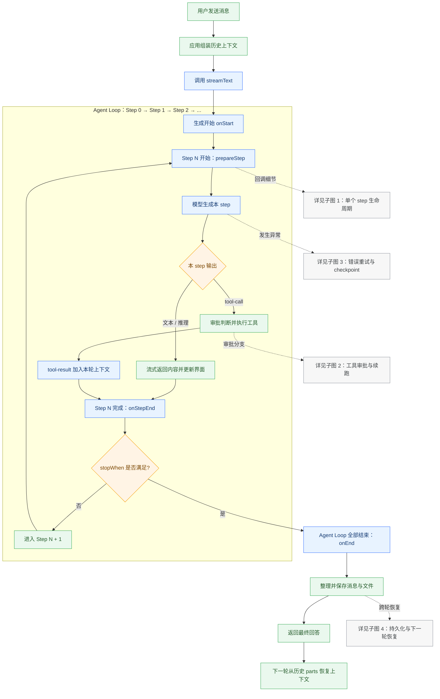
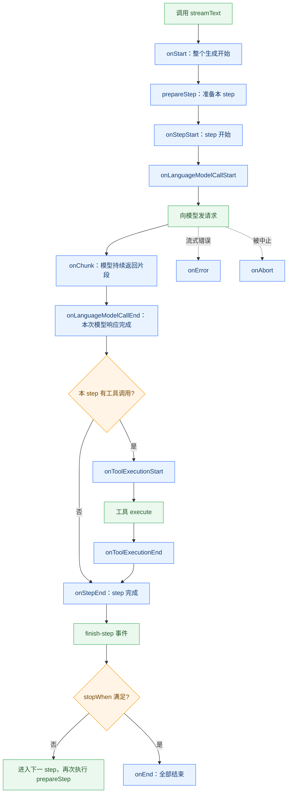
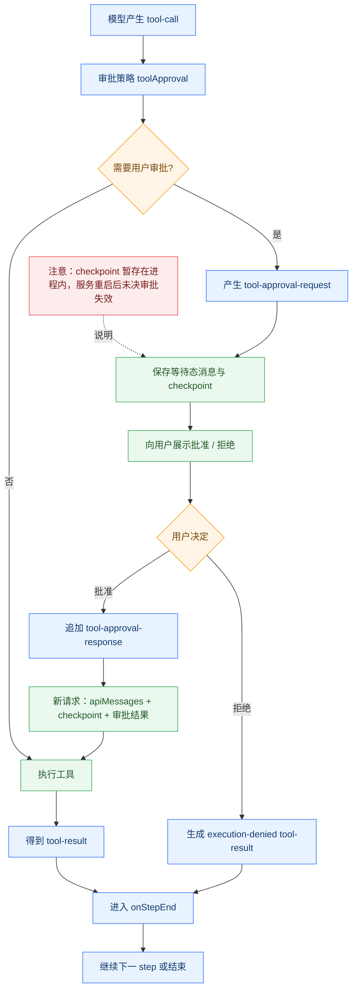
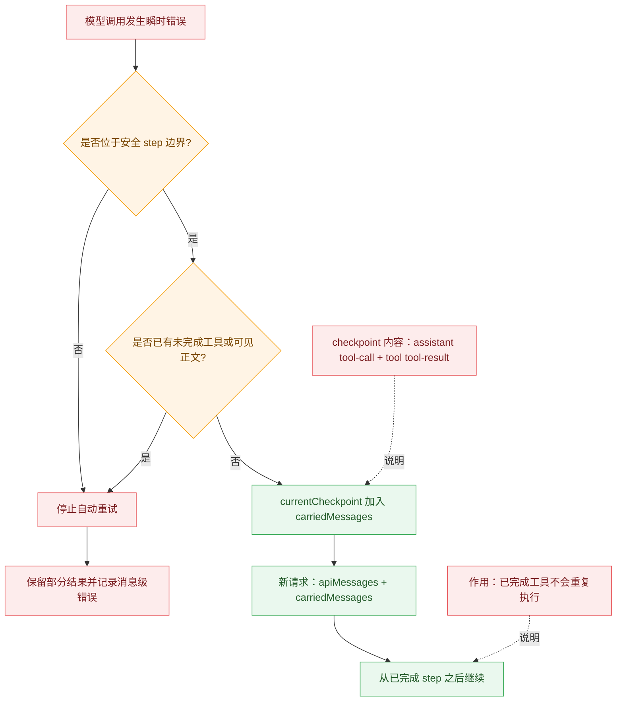
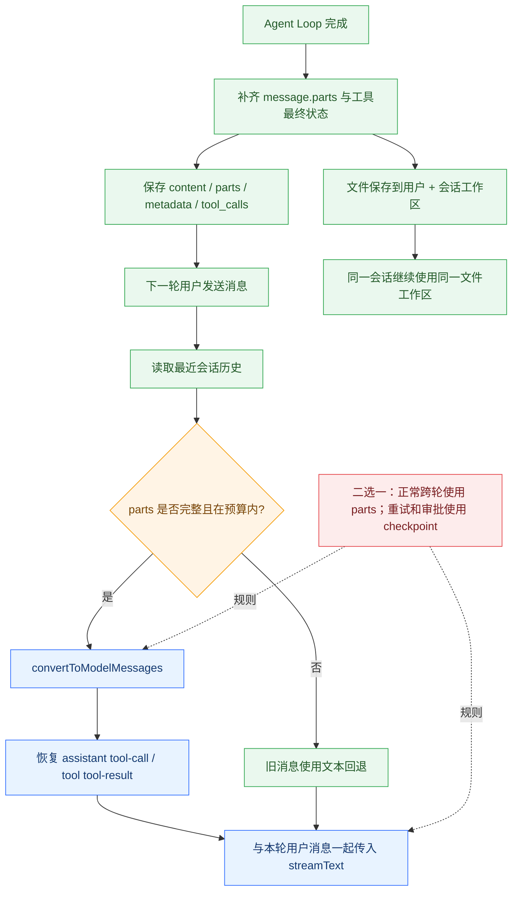

# streamText

**核心概念：**`streamText` 不只是“流式返回一段文本”的接口。当传入 `tools` 和 `stopWhen` 后，它会负责驱动一个多步 Agent Loop：反复调用模型、执行工具、把工具结果交回模型，直到模型完成回答或命中停止条件。

一次模型调用称为一个 **step**。模型在当前 step 可以直接生成文本，也可以产生 `tool-call`。如果产生工具调用，SDK 会执行工具，把 `tool-result` 加入本轮消息上下文，再根据 `stopWhen` 判断进入下一个 step 还是结束。因此一轮用户请求可能包含 `Step 0 → Step 1 → Step 2 → ...` 多次模型调用。

`streamText` 会持续输出文本、推理、来源、文件、工具调用、工具结果、step 结束和最终结束等事件；生命周期回调则用于观察生成开始、模型请求、工具执行和 step 完成等时机。SDK 负责本轮循环，应用负责消费事件、更新界面、审批、重试、保存消息与文件，以及下一轮上下文恢复。

## Agent Loop 全局流程

先看总览掌握主流程，再按需查看下面 4 张子流程图。



### 子流程 1：单个 step 与 SDK 回调时机



蓝色节点是 SDK 标准回调；绿色节点是实际工作；橙色节点是流程判断。`prepareStep` 发生在每个 step 的模型请求之前，`onStepEnd` 发生在该 step 的文本、工具调用和工具结果都落定之后。

### 子流程 2：工具审批与续跑



### 子流程 3：错误重试与 checkpoint



### 子流程 4：消息持久化与下一轮恢复



## streamText 参数全景

```TypeScript
streamText({
  // ══════════ 模型与提示词 ══════════
  model,                          // 必填。LanguageModel 实例
  instructions,                   // 系统提示词。string | SystemModelMessage | SystemModelMessage[]
                                  //   数组形式可让 Anthropic 拆多个 system block 各带 cache_control
  system,                         // ⚠️ deprecated → instructions（同时给则 instructions 优先）
  prompt,                         // string | ModelMessage[]。与 messages 互斥（类型层面强制）
  messages,                       // ModelMessage[]。与 prompt 互斥
  allowSystemInMessages: false,   // 是否允许 messages 里出现 role:'system'。
                                  //   v7 默认 false（拒绝），这是 breaking。仅对可信消息开启，
                                  //   否则用户可注入 system 覆盖你的提示词

  // ══════════ 采样参数 ══════════
  maxOutputTokens,                // 最大生成 token 数
  temperature,                    // 温度。范围取决于 provider。建议与 topP 二选一
  topP,                           // 核采样 0~1。0.1 = 只取概率质量前 10% 的 token
  topK,                           // 只从每步概率最高 K 个候选采样，砍长尾。
                                  //   官方注明仅进阶场景需要，通常调 temperature 就够
  presencePenalty,                // 存在惩罚 -1(增加重复) ~ 1(最大惩罚)。影响重复"提示词已有信息"
  frequencyPenalty,               // 频率惩罚 -1 ~ 1。影响反复使用同一词句
  stopSequences,                  // string[]。命中即停止生成。provider 可能有数量上限
  seed,                           // 随机种子。模型支持时可得确定性结果
  reasoning,                      // 推理力度。'provider-default' 用默认，'none' 关闭（需支持）

  // ══════════ 请求控制 ══════════
  maxRetries: 2,                  // 最大重试次数，0 = 禁用。默认 2
  abortSignal,                    // AbortSignal
  timeout,                        // TimeoutConfiguration
  headers,                        // 额外 HTTP 头，仅 HTTP 类 provider 有效
  providerOptions,                // provider 专属选项，如
                                  //   { openai: { promptCacheKey }, anthropic: { cacheControl } }

  // ══════════ 工具 ══════════
  tools,                          // 工具集
  toolsContext,                   // 工具集的类型化上下文。工具声明必填 context 时此项变必填
  toolChoice: 'auto',             // 工具选择策略。默认 'auto'
  activeTools,                    // 限制本次可用的工具子集，但不改变结果里 call/result 的类型
  toolOrder,                      // 工具定义发给 provider 的顺序。可只列一部分，
                                  //   未列出的排后面按字母序。顺序稳定能提升 provider 侧缓存命中
  toolApproval,                   // 工具执行前的审批配置（v7 取代了 needsApproval）
  repairToolCall,                 // 模型产出非法工具入参时的修复钩子
  experimental_repairToolCall,    // ⚠️ deprecated → repairToolCall
  experimental_refineToolInput,   // 工具入参精修
  experimental_toolCallers,       // 自定义工具调用器
  experimental_toolApprovalSecret,// 审批签名密钥

  // ══════════ 多步循环 ══════════
  stopWhen: isStepCount(1),       // 末步有工具结果时的停止条件。传数组则任一满足即停。
                                  //   默认 isStepCount(1)。v7 里 stepCountIs 改名为 isStepCount
  prepareStep,                    // 每步开始前改写本步设置。入参含 stepNumber/model/messages，
                                  //   返回 undefined 或字段 undefined 则沿用外层。
                                  //   常用于上下文压缩、按步切 activeTools/toolChoice
  runtimeContext,                 // 跨工具与回调共享的运行时数据（v7 从 experimental_context 拆出）
  output,                         // 结构化输出解析规格（v7 取代 experimental_output）

  // ══════════ 生命周期回调 ══════════
  onStart,                        // 操作开始，任何 LLM 调用之前
  onStepStart,                    // 每个 step 开始
  onStepEnd,                      // 每个 step 结束（tool results 此刻已落定）
                                  //   ⚠️ step.response.messages 只含本步产出，不再累积！
  onEnd,                          // 整个操作结束
  onChunk,                        // 每个流 part。⚠️ v7 起收到「全部」part 类型，
                                  //   v6 只给子集 —— 旧处理器需补类型守卫
  onError,                        // 出错
  onAbort,                        // 被中止
  onLanguageModelCallStart,       // 单次 LLM 调用开始
  onLanguageModelCallEnd,         // 单次 LLM 调用结束
  onToolExecutionStart,           // 工具执行前。SDK 会 await 它，
                                  //   适合放执行前的 durable 写入（失败即阻断工具执行）
  onToolExecutionEnd,             // 工具执行后

  // ⚠️ 以下均为 deprecated 别名，仅在新名未提供时作为回退生效：
  onStepFinish,                   // → onStepEnd
  onFinish,                       // → onEnd
  experimental_onStart,           // → onStart
  experimental_onStepStart,       // → onStepStart
  experimental_onLanguageModelCallStart,  // → onLanguageModelCallStart
  experimental_onLanguageModelCallEnd,    // → onLanguageModelCallEnd
  experimental_onToolCallStart,   // → onToolExecutionStart
  experimental_onToolCallFinish,  // → onToolExecutionEnd

  // ══════════ 遥测 ══════════
  telemetry,                      // TelemetryOptions。v7 把 OTel 集成挪到独立包 @ai-sdk/otel，
                                  //   注册 integration 后默认启用；旧的 tracer 属性已移除
  experimental_telemetry,         // ⚠️ deprecated → telemetry

  // ══════════ 返回内容裁剪 ══════════
  include: {
    requestBody: false,           // 是否在 step 结果里保留请求体。发图片/文件时会很大。默认 false
    requestMessages: false,       // 是否保留请求消息。同上。默认 false
                                  //   ⚠️ v6 默认保留，v7 改为不保留 —— 读 step.request.body 会拿到 undefined
    rawChunks: false,             // 是否把 provider 原始 chunk（type:'raw'）放进流，
                                  //   用于访问 SDK 尚未封装的前沿特性。默认 false
  },
  experimental_include,           // ⚠️ deprecated → include
  includeRawChunks,               // ⚠️ deprecated → include.rawChunks

  // ══════════ 其他 / 实验性 ══════════
  experimental_transform,         // 流变换，如平滑输出。可传数组
  experimental_download,          // 自定义远程资源下载函数
  experimental_sandbox,           // 沙箱会话
  _internal,                      // { now, generateId, generateCallId } 内部测试注入点，勿用
});
```

### 模型与提示词

```TypeScript
model: LanguageModel               // 必填。要使用的语言模型
instructions?: Instructions        // 统一使用的系统提示词。v7 新名，可与 prompt/messages 同时用
system?: Instructions              // ⚠️ @deprecated → 用 instructions
prompt: string | ModelMessage[]    // 提示词。与 messages 互斥（二者必须提供其一）
messages: ModelMessage[]           // 消息列表。与 prompt 互斥
allowSystemInMessages?: boolean     // 是否允许 messages 里出现 role:'system'
                                    // @default false —— v7 默认拒绝，这是个 breaking
                                    
type Instructions = string | SystemModelMessage | Array<SystemModelMessage>;
```

#### 1.1 Instructions 三种形态：为 provider 缓存断点让路

**先记住一个选择原则：**默认使用字符串。只有需要给模型供应商附加特殊控制参数时，才升级为对象；只有不同段落需要不同控制参数时，才使用数组。

- **`string`｜普通系统提示词**  
直接写一段文本即可，最简单，也最容易维护。角色设定、回答规则、业务约束等绝大多数场景都用这种形式。  
`instructions: "你是一个产品助手，请用简体中文回答。"`
- **`SystemModelMessage`｜一段提示词 + 一组供应商配置**  
提示词仍然只有一段，但需要同时携带 `providerOptions`。例如给整段 Anthropic system prompt 设置 `cacheControl`，告诉供应商可以在这里建立缓存断点。不是因为提示词更复杂，而是因为要附加供应商专属参数。
- **`SystemModelMessage[]`｜多段提示词分别配置**  
把 system prompt 拆成多个有先后顺序的 block，每个 block 可以设置不同的 `providerOptions`。典型做法是把长期不变的规则放在前面并设置缓存，把会话摘要、当前页面信息等经常变化的内容放在后面且不设置缓存。这样动态内容变化时，不会让前面的稳定缓存一起失效。

**为什么这和缓存断点有关？**供应商通常按消息 block 识别缓存边界。字符串无法单独给某一段加 provider 配置；单个对象只能控制整段；数组才能明确划分“稳定区”和“变化区”，并分别设置缓存策略。

**快速选择：**没有供应商专属配置 → 用 `string`；整段共用一套配置 → 用 `SystemModelMessage`；多个段落需要不同配置 → 用 `SystemModelMessage[]`。不要为了形式统一而默认使用数组。

#### 1.2 prompt / messages 互斥：把歧义前移到编译期

**先记住一个选择原则：**一次请求只选一种输入方式。简单的一次性任务用 `prompt`；聊天、多轮上下文或包含工具调用历史时用 `messages`。两者不能同时传。

- **`prompt`｜只描述“这一次要做什么”**  
适合单次生成，例如改写一句话、生成标题、总结一段文本。调用方不需要维护完整对话历史，写法最简单。
- **`messages`｜描述“到目前为止发生了什么”**  
适合聊天和 Agent 场景。它可以携带 user、assistant、tool 等多种角色，以及前面 step 的 `tool-call/tool-result`，让模型基于完整上下文继续处理。

**为什么必须互斥？**如果同时传入，SDK 无法明确判断：`prompt` 是要追加到 `messages` 后面，还是替换最后一条用户消息；两边出现重复内容时该保留哪一份；工具结果与新问题之间的顺序又该如何排列。任何一种运行时猜测都可能造成重复输入或上下文顺序错误。

因此 AI SDK 使用 TypeScript 联合类型把歧义提前到编译期：选择 `prompt` 时，`messages` 必须不存在；选择 `messages` 时，`prompt` 必须不存在。错误代码在开发阶段就会报错，而不是请求发出后才出现不确定行为。

```TypeScript
// 正确：单次任务使用 prompt
streamText({
  model,
  instructions: "你是一个产品助手。",
  prompt: "把这段需求改写得更清楚。",
});

// 正确：多轮聊天使用 messages
streamText({
  model,
  instructions: "你是一个产品助手。",
  messages: [
    { role: "user", content: "生成一个脚本" },
    { role: "assistant", content: "脚本已生成" },
    { role: "user", content: "继续修改它" },
  ],
});

// 错误：prompt 与 messages 同时出现
streamText({
  model,
  prompt: "继续修改",
  messages,
});
```

**容易混淆的一点：**`instructions` 是系统级规则，可以和 `prompt` 或 `messages` 任意一种搭配；互斥的只有 `prompt` 与 `messages`。

**快速选择：**不需要历史 → 用 `prompt`；需要对话历史、工具结果或多轮 Agent 上下文 → 用 `messages`。

#### 1.3 多轮次上下文携带

**核心结论：**AI 能在下一轮继续引用前面生成的文件或工具结果，是因为应用持久化了完整消息与产物，并在下一轮重新组装成 SDK 标准消息传给 `streamText({ messages })`。

### 采样参数（来自 `LanguageModelCallOptions`）

```TypeScript
maxOutputTokens?: number      // 生成的最大 token 数
temperature?: number          // 温度。范围取决于 provider/模型。建议与 topP 二选一
topP?: number                 // 核采样，0~1。如 0.1 = 只考虑概率质量前 10% 的 token
topK?: number                 // 只从每步概率最高的 K 个候选采样，用于砍掉长尾
                              // 官方注明仅进阶场景需要，通常调 temperature 就够
presencePenalty?: number      // 存在惩罚，-1(增加重复) ~ 1(最大惩罚)，0 = 不惩罚
                              // 影响模型重复"提示词里已有信息"的倾向
frequencyPenalty?: number     // 频率惩罚，-1 ~ 1，0 = 不惩罚
                              // 影响模型反复使用同一词句的倾向
stopSequences?: string[]       // 停止序列。命中即停止生成。provider 可能有数量上限
seed?: number                 // 随机采样种子。模型支持时可得到确定性结果
reasoning?: ...               // 推理力度。'provider-default' 用 provider 默认值，
                              // 'none' 关闭推理（需 provider 支持）
```

### 请求控制（来自 `RequestOptions`）

```TypeScript
maxRetries?: number                  // 最大重试次数，0 = 禁用。@default 2
abortSignal?: AbortSignal            // 中止信号
headers?: Record<string, string|undefined>  // 额外 HTTP 头，仅 HTTP 类 provider 有效
timeout?: TimeoutConfiguration<TOOLS>       // 超时配置
providerOptions?: ProviderOptions           // provider 专属选项
                                            // （如 openai.promptCacheKey、anthropic.cacheControl）
```

#### providerOptions 是什么？

`providerOptions` 可以理解成“给当前模型厂商附带的一张专属配置单”。像 `maxRetries`、`timeout` 这类通用参数，所有 Provider 都能理解；但提示词缓存、推理强度、扩展思考等能力，各家写法不一样，就需要放在 `providerOptions` 里。

**怎么写？** 第一层 key 写 Provider 名称，例如 `openai` 或 `anthropic`；第二层再写该 Provider 支持的专属参数。实际使用哪个 Provider，就读取对应的那一组配置。

```TypeScript
const result = streamText({
  model: openai('gpt-5'),
  prompt: '帮我评审这份产品文档',
  providerOptions: {
    openai: {
      promptCacheKey: 'product-doc-review-v1',
    },
  },
});
```

```TypeScript
const result = streamText({
  model: anthropic('claude-sonnet-4-5'),
  prompt: '分析这个复杂问题',
  providerOptions: {
    anthropic: {
      thinking: {
        type: 'enabled',
        budgetTokens: 10_000,
      },
    },
  },
});
```

**使用建议：** 只有在启用某个 Provider 的专属能力时才需要传它；普通重试、超时、请求头等仍使用上面的通用参数。

#### 当前项目版本与适用范围

以下清单来自项目当前安装的 `@ai-sdk/openai 4.0.46` 和 `@ai-sdk/anthropic 4.0.41` 类型定义，只统计 `streamText(...).providerOptions` 的请求级语言模型参数，不包含 embedding、图片、语音、文件 part 或单个工具自己的专属参数。表中字段全部是可选项，为便于阅读，类型里省略了 `undefined`。

本项目的 OpenAI `auto` 模式会先探测 Responses API；支持时走 `openai(model)`，不支持时降级到 `openai.chat(model)`。两条接口支持的参数不完全相同，所以需要分开看。

#### OpenAI providerOptions

##### Responses API（默认优先，28 项）

| 参数 | 类型 / 可选值 | 作用 |
|-|-|-|
| `conversation` | `string \| null` | 继续一个已创建的 OpenAI Conversation。不能和 `previousResponseId` 同时使用。 |
| `include` | `Array<'reasoning.encrypted_content' \| 'file_search_call.results' \| 'web_search_call.results' \| 'message.output_text.logprobs'>` | 要求响应额外带回指定明细，例如搜索结果、加密推理内容或输出 token 的概率。 |
| `instructions` | `string \| null` | 给模型补充指令；续接 `previousResponseId` 时，可用它替换或调整 system/developer 指令。 |
| `logprobs` | `boolean \| number(1~20)` | 返回生成 token 的对数概率；传数字时还返回每个位置概率最高的前 N 个候选。会增大响应并可能变慢。 |
| `maxToolCalls` | `number \| null` | 限制一次响应中内置工具调用的总次数，超过后模型继续发起的调用会被忽略。 |
| `metadata` | `any` | 给本次生成附加业务元数据，便于后续查询、归档或审计。 |
| `parallelToolCalls` | `boolean \| null` | 是否允许模型并行调用多个工具；默认允许。 |
| `previousResponseId` | `string \| null` | 接着上一条 Response 继续对话，省去重复传完整上下文。不能和 `conversation` 同时使用。 |
| `promptCacheKey` | `string \| null` | 给相同前缀的请求设置稳定缓存分片键，提高提示词缓存命中率；常用会话 ID。 |
| `promptCacheOptions` | `{ mode?: 'implicit' \| 'explicit'; ttl?: '30m' }` | GPT-5.6+ 的缓存策略：控制是否允许隐式断点，以及缓存至少保留 30 分钟。 |
| `promptCacheRetention` | `'in_memory' \| '24h' \| null` | 旧模型的缓存保留策略；`24h` 最长保留一天。GPT-5.6+ 已废弃，改用 `promptCacheOptions.ttl`。 |
| `reasoningEffort` | `string \| null` | 控制推理模型“想多深”。常见值有 `none/low/medium/high/xhigh/max`，具体取值由模型决定。 |
| `reasoningMode` | `'standard' \| 'pro'` | GPT-5.6 的推理工作模式；`pro` 通常质量更高，但更慢、消耗更多 token。 |
| `reasoningContext` | `'auto' \| 'current_turn' \| 'all_turns'` | 控制模型能使用哪些历史推理项：自动、只看当前轮，或允许使用所有兼容历史轮次。 |
| `reasoningSummary` | `string \| null` | 要求模型返回推理摘要；常用 `auto` 或 `detailed`。它控制是否回传摘要，不等于提高推理强度。 |
| `safetyIdentifier` | `string \| null` | 传入稳定且不含个人信息的终端用户标识，供 OpenAI 做安全监控和滥用检测。 |
| `serviceTier` | `'auto' \| 'flex' \| 'priority' \| 'fast' \| 'default' \| null` | 选择服务档位：`flex` 更便宜但更慢，`priority/fast` 更快但通常更贵；可用性取决于模型和账号。 |
| `store` | `boolean \| null` | 是否让 OpenAI 保存本次生成；Responses API 默认通常为 `true`。 |
| `passThroughUnsupportedFiles` | `boolean` | 允许把非图片、非 PDF 的文件按通用 input file 透传给支持它们的 Responses 模型，例如 CSV。 |
| `strictJsonSchema` | `boolean \| null` | 生成结构化 JSON 时是否使用严格 Schema 校验；默认开启，能减少字段缺失或格式漂移。 |
| `textVerbosity` | `'low' \| 'medium' \| 'high' \| null` | 控制最终回答的详略程度：简短、适中或详细。 |
| `truncation` | `'auto' \| 'disabled' \| null` | 上下文过长时是否允许服务端自动截断；关闭后，超长请求可能直接报错。 |
| `user` | `string \| null` | 旧式终端用户标识，用于滥用检测；新接入通常优先使用 `safetyIdentifier`。 |
| `systemMessageMode` | `'system' \| 'developer' \| 'remove'` | 决定系统提示词用 `system` 角色、`developer` 角色，还是直接移除；SDK 默认会按模型自动判断。 |
| `forceReasoning` | `boolean` | 强制把当前模型当成推理模型处理，适合自定义 baseURL 下模型 ID 无法被 SDK 识别的情况。 |
| `contextManagement` | `Array<{ type: 'compaction'; compactThreshold: number }> \| null` | 开启服务端上下文压缩，并设置触发压缩的阈值，减少超长对话占用。 |
| `compactionTrigger` | `boolean` | 显式要求本次输入追加一次压缩触发项，而不是只等阈值自动触发。 |
| `allowedTools` | `{ toolNames: string[]; mode?: 'auto' \| 'required' }` | 工具定义仍全部保留，但只允许模型调用指定子集；有利于在动态工具权限下继续命中提示词缓存。 |

##### Chat Completions（降级路径，18 项）

| 参数 | 类型 / 可选值 | 作用 |
|-|-|-|
| `logitBias` | `Record<tokenId, number>` | 按 token ID 调整某些词出现的概率，通常取 -100 到 100；负值压低，正值提高。 |
| `logprobs` | `boolean \| number` | 返回生成 token 的概率；传数字时返回每个位置概率最高的前 N 个候选。 |
| `parallelToolCalls` | `boolean` | 是否允许一次生成并行发起多个工具调用；默认允许。 |
| `user` | `string` | 终端用户的稳定标识，帮助 OpenAI 做安全监控和滥用检测。 |
| `reasoningEffort` | `'none' \| 'minimal' \| 'low' \| 'medium' \| 'high' \| 'xhigh' \| 'max'` | 控制推理模型的思考强度；越高通常越慢、token 消耗越多，且不是每个模型都支持全部档位。 |
| `maxCompletionTokens` | `number` | 限制回答可生成的最大 token 数，尤其适合包含隐藏推理 token 的模型。 |
| `store` | `boolean` | 是否让服务端持久化本次生成结果。 |
| `metadata` | `Record<string, string>` | 给请求附加可检索的键值元数据；当前 Schema 限制 key 最长 64、value 最长 512。 |
| `prediction` | `Record<string, any>` | 提供“预期输出”以启用预测模式；当大部分输出已知、只改少量内容时可降低延迟。 |
| `serviceTier` | `'auto' \| 'flex' \| 'priority' \| 'fast' \| 'default'` | 选择价格和延迟档位；支持情况取决于模型和账号权限。 |
| `strictJsonSchema` | `boolean` | 结构化输出是否使用严格 JSON Schema 校验；默认开启。 |
| `textVerbosity` | `'low' \| 'medium' \| 'high'` | 控制回答的详略程度。 |
| `promptCacheKey` | `string` | 手动指定提示词缓存分片键，提高相同前缀请求的缓存命中率。 |
| `promptCacheOptions` | `{ mode?: 'implicit' \| 'explicit'; ttl?: '30m' }` | GPT-5.6+ 的提示词缓存行为和最短缓存时间配置。 |
| `promptCacheRetention` | `'in_memory' \| '24h'` | 旧模型的缓存保留策略；GPT-5.6+ 已废弃，改用 `promptCacheOptions.ttl`。 |
| `safetyIdentifier` | `string` | 用于安全监控的稳定用户标识，建议使用哈希或内部 ID，不要传姓名、邮箱等个人信息。 |
| `systemMessageMode` | `'system' \| 'developer' \| 'remove'` | 指定系统提示词角色或移除系统提示词；通常让 SDK 自动选择即可。 |
| `forceReasoning` | `boolean` | 强制套用推理模型兼容规则，适用于代理服务或自定义模型名。 |

#### Anthropic providerOptions（16 项）

| 参数 | 类型 / 可选值 | 作用 |
|-|-|-|
| `sendReasoning` | `boolean` | 是否把历史 reasoning/thinking 内容继续发给模型；目标模型不支持推理输入时可关闭。 |
| `structuredOutputMode` | `'outputFormat' \| 'jsonTool' \| 'auto'` | 结构化输出的实现方式：走原生输出格式、模拟 JSON 工具，或让 SDK 自动选择；默认 `auto`。 |
| `thinking` | `{ type: 'adaptive'; display?: 'omitted' \| 'summarized' } \| { type: 'enabled'; budgetTokens?: number } \| { type: 'disabled' }` | 开启、关闭或自适应扩展思考。旧式 `enabled` 可设置思考 token 预算，最低通常为 1024；新模型优先使用 `adaptive`。 |
| `disableParallelToolUse` | `boolean` | 设为 `true` 后，每次响应最多调用一个工具；默认可并行调用。 |
| `cacheControl` | `{ type: 'ephemeral'; ttl?: '5m' \| '1h' }` | 设置临时提示词缓存断点和有效期。项目中通常把它放到 system、message 或 tool 的 `providerOptions` 上，以缓存稳定前缀。 |
| `metadata` | `{ userId?: string }` | 给请求附加终端用户的外部标识；应使用 UUID、哈希或内部 ID，不能包含姓名、邮箱、手机号等个人信息。 |
| `mcpServers` | `Array<{ type: 'url'; name: string; url: string; authorizationToken?: string \| null; toolConfiguration?: { enabled?: boolean \| null; allowedTools?: string[] \| null } \| null }>` | 让 Claude 在本次请求中连接远程 MCP Server，可携带鉴权 token，并限制是否启用及允许哪些工具。 |
| `container` | `{ id?: string; skills?: Array<AnthropicSkill \| CustomSkill> }` | 复用代码执行容器，或给容器挂载 Anthropic 内置 / 自定义 Agent Skills；使用技能时通常还需启用代码执行工具。 |
| `toolStreaming` | `boolean` | 是否对函数工具输入和结构化输出启用细粒度流式传输；默认 `true`，可更早拿到工具参数片段。 |
| `effort` | `'low' \| 'medium' \| 'high' \| 'xhigh' \| 'max'` | 控制模型整体投入程度；越高通常质量更高，但延迟和 token 消耗也更大。默认 `high`。 |
| `taskBudget` | `{ type: 'tokens'; total: number; remaining?: number }` | 告诉模型整个 Agent 任务还剩多少 token，让它安排节奏并及时收尾；只是建议，不是硬性截断。`total` 最低 20000。 |
| `speed` | `'fast' \| 'standard'` | 选择快速或标准推理模式；当前类型注释说明仅 Claude Opus 4.6 支持快速模式。 |
| `inferenceGeo` | `'us' \| 'global'` | 控制推理运行地域：只在美国基础设施，或允许全球路由。 |
| `fallbacks` | `'default' \| Array<{ model: string; max_tokens?: number; thinking?: object; output_config?: object; speed?: 'fast' \| 'standard' }>` | 主模型被安全分类器拦截时，由服务端自动换备用模型重试；可使用官方默认策略，也可指定备用链。 |
| `anthropicBeta` | `string[]` | 显式开启 Anthropic Beta 功能，把对应 beta 名称随请求发送；只在确定接口要求时使用。 |
| `contextManagement` | `{ edits: Array<clear_tool_uses \| clear_thinking \| compact> }` | 服务端上下文管理：可按 token/工具次数清理旧工具调用、保留或清理历史 thinking，或触发上下文压缩。 |

**最后提醒：** “SDK 类型里有这个字段”只表示当前 Provider 能识别它，不代表每个模型、代理网关或账号都支持。使用推理、缓存、服务档位、地域、快速模式等能力时，还要结合具体模型能力；不支持时通常会被忽略、产生 warning，或由上游 API 返回参数错误。

### 工具

```TypeScript
tools?: TOOLS                        // 工具集
toolsContext?: InferToolSetContext<TOOLS>   // 工具集的类型化上下文。
                                     // 工具声明了必填 context 时此项变必填
toolChoice?: ToolChoice<TOOLS>       // 工具选择策略。@default 'auto'
activeTools?: ActiveTools<TOOLS>     // 限制本次可调用的工具子集，
                                     // 但不改变结果里 tool call/result 的类型
toolOrder?: ToolOrder<TOOLS>         // 控制工具定义发给 provider 的顺序。可以只列一部分，
                                     // 未列出的排在后面按字母序 —— 顺序稳定能提升
                                     // provider 侧的缓存命中率
toolApproval?: ToolApprovalConfiguration<TOOLS, RUNTIME_CONTEXT>
                                     // 工具执行前的审批配置（v7 取代了 needsApproval）
repairToolCall?: ToolCallRepairFunction<TOOLS>          // 模型产出非法工具入参时的修复钩子
experimental_repairToolCall?: ...                       // ⚠️ @deprecated → repairToolCall
experimental_refineToolInput?: ToolInputRefinement<TOOLS>   // 工具入参精修
experimental_toolCallers?: Experimental_ToolCallers<TOOLS>  // 自定义工具调用器
experimental_toolApprovalSecret?: string | Uint8Array       // 审批签名密钥
```

### 多步循环

```TypeScript
stopWhen?: Arrayable<StopCondition<TOOLS, RUNTIME_CONTEXT>>
    // 末步有工具结果时的停止条件。传数组则任一满足即停止
    // @default isStepCount(1)  ← v7 里 stepCountIs 改名为 isStepCount
prepareStep?: PrepareStepFunction<TOOLS, RUNTIME_CONTEXT>
    // 每步开始前改写本步设置。入参含 stepNumber / model / messages 等
    // 返回 undefined（或某字段 undefined）则沿用外层设置
    // 常用于上下文压缩、按步切换 activeTools/toolChoice
runtimeContext?: RUNTIME_CONTEXT
    // 跨工具/回调共享的运行时数据。v7 从 experimental_context 拆出来的
output?: OUTPUT
    // 结构化输出解析规格（v7 取代了 experimental_output）
```

### 生命周期回调

```TypeScript
onStart?                      // 操作开始，任何 LLM 调用之前
onStepStart?                  // 每个 step 开始
onStepEnd?                    // 每个 step 结束（tool results 此刻已落定）
onEnd?                        // 整个操作结束
onChunk?                      // 每个流 part。⚠️ v7 起会收到「全部」part 类型，
                              //    v6 只给文本/推理/工具等子集 —— 旧处理器需加类型守卫
onError?                      // 出错
onAbort?                      // 被中止
onLanguageModelCallStart?     // 单次 LLM 调用开始
onLanguageModelCallEnd?       // 单次 LLM 调用结束
onToolExecutionStart?         // 工具执行前（await 它，可用于执行前的持久化写入）
onToolExecutionEnd?           // 工具执行后

// ⚠️ 以下均为 @deprecated 别名：
experimental_onStart / experimental_onStepStart
experimental_onLanguageModelCallStart / experimental_onLanguageModelCallEnd
onStepFinish        → onStepEnd
onFinish            → onEnd
experimental_onToolCallStart  → onToolExecutionStart
experimental_onToolCallFinish → onToolExecutionEnd
```

### 遥测

```TypeScript
telemetry?: TelemetryOptions<...>              // v7 新名
experimental_telemetry?: TelemetryOptions<...>  // ⚠️ @deprecated → telemetry
```

v7 把 OpenTelemetry 集成挪到了独立包 `@ai-sdk/otel`，且注册 integration 后默认启用；旧的 `tracer` 属性已移除。

### 返回内容裁剪

```TypeScript
include?: StreamTextInclude          // v7 新名
experimental_include?: ...           // ⚠️ @deprecated → include

// StreamTextInclude:
//   requestBody?: boolean      是否在 step 结果里保留请求体。
//                              发图片/文件时请求体会很大。@default false
//   requestMessages?: boolean  是否保留请求消息。同上。@default false
//   rawChunks?: boolean        是否把 provider 原始 chunk（type:'raw'）放进流，
//                              用于访问 SDK 尚未封装的前沿特性。@default false

includeRawChunks?: boolean           // ⚠️ @deprecated → include.rawChunks
```

v7 起请求体/请求消息**默认不保留**（v6 默认保留），这是个静默的行为变化——如果你的代码读 `step.request.body` 会拿到 undefined。

### 其他 / 实验性

```TypeScript
experimental_transform?: Arrayable<StreamTextTransform<TOOLS>>  // 流变换（如平滑输出）
experimental_download?: DownloadFunction | undefined            // 自定义远程资源下载
experimental_sandbox?: Experimental_SandboxSession              // 沙箱会话
_internal?: { now, generateId, generateCallId }                 // 内部测试注入点，勿用
```

# TextStreamPart 到 UIMessageChunk 映射

| TextStreamPart.type | UIMessageChunk.type | 说明 |
|-|-|-|
| `text-start` | `text-start` | 标记一个新的文本片段开始，携带文本片段 `id` 和可选 `providerMetadata`；后续 `text-delta` / `text-end` 使用同一 `id` 归并。 |
| `text-delta` | `text-delta`，字段从 `text` 变成 `delta` | 流式文本增量；把模型侧的 `text` 字段改名为 UI 协议里的 `delta`，按 `id` 追加到对应文本片段。 |
| `text-end` | `text-end` | 标记当前文本片段结束，携带同一个 `id` 和可选 `providerMetadata`。 |
| `reasoning-start` | `reasoning-start`，可被 `sendReasoning=false` 关闭 | 标记推理内容片段开始；用于支持 reasoning tokens 的模型，关闭 reasoning 转发时不产生 UI chunk。 |
| `reasoning-delta` | `reasoning-delta`，字段从 `text` 变成 `delta` | 推理文本增量；把 `text` 改名为 `delta`，按 `id` 追加到对应 reasoning 片段，关闭 reasoning 转发时不发送。 |
| `reasoning-end` | `reasoning-end` | 标记推理内容片段结束；关闭 reasoning 转发时不产生 UI chunk。 |
| `custom` | `custom` | 透传提供商自定义内容，包含 `kind`（形如 `{provider}.{provider-type}`）和可选 `providerMetadata`。 |
| `file` | `file`，文件转成 data URL | 模型生成的普通文件；用 `GeneratedFile.base64` 和 `mediaType` 生成 `url` data URL，并保留媒体类型。 |
| `reasoning-file` | `reasoning-file` | 推理过程中产生的文件，字段映射方式与 `file` 相同；关闭 reasoning 转发时不产生 UI chunk。 |
| `source` | `source-url` / `source-document`，默认 `sendSources=false` 时不发 | 来源引用；只有开启 sources 转发时发送，URL 来源映射为 `source-url`，文档来源映射为 `source-document`，并把 `id` 改为 `sourceId`。 |
| `tool-input-start` | `tool-input-start`，`id` 变成 `toolCallId` | 标记工具输入开始流式生成；保留 `toolName`、provider/tool metadata、`providerExecuted`、`dynamic` 和可选标题。 |
| `tool-input-delta` | `tool-input-delta`，`delta` 变成 `inputTextDelta` | 工具输入的文本增量；按 `toolCallId` 归并，并把 `delta` 改名为 `inputTextDelta`。 |
| `tool-input-end` | 丢弃 | 仅表示流式工具输入结束，本身不产生 UI chunk；完整输入会通过后续 `tool-call` 映射成 `tool-input-available` 或 `tool-input-error`。 |
| `tool-call` | `tool-input-available` | 表示工具调用输入已经完整可用；合法调用映射为 `tool-input-available`，包含 `toolCallId`、`toolName`、`input` 以及相关 metadata。 |
| invalid `tool-call` | `tool-input-error` | `tool-call` 标记为 invalid 时产生；保留原始 `input`，并通过 `onError` 把错误转换为面向 UI 的 `errorText`。 |
| `tool-result` | `tool-output-available` | 工具执行成功并产出结果；`output` 为 `undefined` 时会转成 `null`，避免 JSON 序列化丢字段。 |
| `tool-error` | `tool-output-error` | 工具执行失败；provider 执行的错误按原始字符串或 JSON 传递，非 provider 执行错误通过 `onError` 转成 `errorText`。 |
| `tool-output-denied` | `tool-output-denied` | 表示工具输出被拒绝或不应返回给客户端；UI chunk 只携带 `toolCallId`。 |
| `tool-approval-request` | `tool-approval-request` | 请求对工具调用进行审批；携带 `approvalId`、`toolCallId`，以及可选 `isAutomatic` 和 `signature`。 |
| `tool-approval-response` | `tool-approval-response` | 审批结果回传；携带 `approvalId`、`approved`，以及可选拒绝原因 `reason` 和 `providerExecuted`。 |
| `start-step` | `start-step` | 标记一次模型调用 step 开始；转换成 UI chunk 时只保留 step 边界，不转发请求体、warnings 等详细信息。 |
| `finish-step` | `finish-step` | 标记当前模型调用 step 结束；转换后只保留 step 结束事件，详细 response、usage 等不会进入该 UI chunk。 |
| `start` | `start` | 标记 UI 消息流开始；可被 `sendStart=false` 关闭，并可附带 `messageId` 与 `messageMetadata`。 |
| `finish` | `finish` | 标记 UI 消息流结束；可被 `sendFinish=false` 关闭，保留 `finishReason` 和可选 `messageMetadata`。 |
| `abort` | `abort` | 表示流被中止；转换时原样转发，可携带可选 `reason`。 |
| `error` | `error`，错误变成 `errorText` | 流式处理中的错误；通过 `onError` 转换为 `errorText`，默认实现会返回通用错误文案以避免泄露服务端细节。 |
| `raw` | 丢弃 | provider 原始流事件，仅供底层观察或调试；不会映射为 UIMessageChunk。 |

**生命周期内不产生可见 part**：`start` / `start-step` / `finish-step` / `finish` / `message-metadata` 只更新状态机和元数据

# 数据库表设计

数据库需要同时解决三类问题：聊天历史可重建、Agent Loop 可恢复、每一步可审计。核心原则是以 `messages 的 `parts` 作为前端渲染事实，以规范化的 run / step / tool / approval 表作为执行事实，以只追加的事件表作为断线恢复与问题定位依据。三者职责不同，不应只靠一张 messages 表承载全部状态。

## 核心关系与生命周期

一次用户输入创建一条 user message，同时创建一条空的 assistant message 和一条 agent run。后续所有 reasoning、tool、approval、question、artifact 与最终 text 都原位归属于该 assistant message。多步循环只增加 step，不新增 assistant message；审批 continuation 继续更新原 run 和原 assistant message。

| 实体 | 主键 / 唯一约束 | 职责 |
|-|-|-|
| conversations | `id` 自增主键；`biz_id` 唯一 | 会话级游标、当前运行状态和列表摘要 |
| messages | `id` 自增主键；`biz_id` 唯一；`(conversation_id, seq)` 唯一 | 用户与 assistant 的稳定消息快照，保存 UIMessage parts |
| agent_runs | `id` 自增主键；`biz_id` 唯一；`assistant_message_id` 唯一 | 一次完整 Agent Loop 的状态、模型、用量和结束原因 |
| agent_steps | `id` 自增主键；`biz_id` 唯一；`(run_id, step_index)` 唯一 | 每次 LLM 调用及该 step 的 finish reason、usage、provider 元数据 |
| tool_calls | `id` 自增主键；`biz_id` 唯一；`(run_id, tool_call_id)` 唯一 | 工具输入、执行状态、输出、错误和产物 |
| tool_approvals | `id` 自增主键；审批 ID 存入 `biz_id`；`(run_id, tool_call_id)` 唯一 | 审批决定、幂等 claim 和 continuation checkpoint |
| agent_checkpoints | `id` 自增主键；`biz_id` 唯一；`(run_id, checkpoint_seq)` 唯一 | 可恢复的 SDK messages、collector 快照和事件游标 |
| agent_stream_events | `id` 自增主键；事件 ID 存入 `biz_id`；`(run_id, seq)` 唯一 | 只追加的持久事件日志，用于重连、补发与审计，支持 SSE 精确重放 |
| agent_artifacts | `id` 自增主键；`biz_id` 唯一 | 文件、飞书文档、原型、URL 等可独立管理的产物 |

## 会话与消息

```sql
DROP TABLE IF EXISTS agent_stream_events;
DROP TABLE IF EXISTS agent_checkpoints;
DROP TABLE IF EXISTS agent_artifacts;
DROP TABLE IF EXISTS tool_approvals;
DROP TABLE IF EXISTS tool_calls;
DROP TABLE IF EXISTS agent_steps;
DROP TABLE IF EXISTS agent_runs;
DROP TABLE IF EXISTS messages;
DROP TABLE IF EXISTS conversations;

CREATE TABLE conversations (
  id                BIGINT UNSIGNED NOT NULL AUTO_INCREMENT PRIMARY KEY COMMENT '自增主键',
  biz_id            VARCHAR(191) NOT NULL COMMENT '会话业务唯一标识，客户端和服务端共同引用',
  user_id           VARCHAR(191) NOT NULL COMMENT '会话所属用户 ID，用于数据隔离和权限校验',
  title             VARCHAR(255) NOT NULL DEFAULT '' COMMENT '会话标题，可自动生成或由用户修改',
  status            VARCHAR(32) NOT NULL DEFAULT 'idle' COMMENT '会话状态：idle/running/waiting_approval/waiting_user/failed',
  active_run_id     VARCHAR(191) NOT NULL DEFAULT '' COMMENT '当前未结束的 Agent Run 业务 ID，无活动 run 时为空字符串',
  last_message_seq  BIGINT UNSIGNED NOT NULL DEFAULT 0 COMMENT '会话内已分配的最大消息序号',
  version           BIGINT UNSIGNED NOT NULL DEFAULT 0 COMMENT '会话乐观锁版本号，状态、标题或游标更新后递增',
  create_time       DATETIME NOT NULL DEFAULT CURRENT_TIMESTAMP COMMENT '创建时间',
  update_time       DATETIME NOT NULL DEFAULT CURRENT_TIMESTAMP ON UPDATE CURRENT_TIMESTAMP COMMENT '更新时间',
  CONSTRAINT conversations_status_check CHECK (status IN ('idle', 'running', 'waiting_approval', 'waiting_user', 'failed')),
  UNIQUE KEY uk_biz_id (biz_id) COMMENT '保证会话业务 ID 唯一',
  KEY idx_conversations_user_updated (user_id, update_time) COMMENT '按用户查询最近会话',
  KEY idx_conversations_active_run (active_run_id) COMMENT '按活动 run 定位会话'
) ENGINE=InnoDB DEFAULT CHARSET=utf8mb4 COLLATE=utf8mb4_general_ci COMMENT='会话主表：保存会话级状态、当前 Agent Run 游标和列表展示信息';

CREATE TABLE messages (
  id                 BIGINT UNSIGNED NOT NULL AUTO_INCREMENT PRIMARY KEY COMMENT '自增主键',
  biz_id             VARCHAR(191) NOT NULL COMMENT '消息业务唯一标识，乐观消息与落库消息复用同一值',
  conversation_id    VARCHAR(191) NOT NULL COMMENT '所属会话业务 ID，对应 conversations.biz_id',
  run_id             VARCHAR(191) NOT NULL DEFAULT '' COMMENT '产生该消息的 Agent Run 业务 ID，用户消息为空字符串',
  parent_message_id  VARCHAR(191) NOT NULL DEFAULT '' COMMENT '父消息业务 ID，用于重试和分支对话，无父消息时为空字符串',
  role               VARCHAR(16) NOT NULL DEFAULT 'user' COMMENT '消息角色：user/assistant',
  seq                BIGINT UNSIGNED NOT NULL DEFAULT 0 COMMENT '消息在会话内的稳定顺序号',
  status             VARCHAR(32) NOT NULL DEFAULT 'completed' COMMENT '消息状态：streaming/waiting/completed/failed/aborted/interrupted',
  content            MEDIUMTEXT NOT NULL COMMENT '可见正文兼容快照，用于搜索、摘要和旧客户端展示',
  parts              MEDIUMTEXT NOT NULL DEFAULT ('[]') COMMENT 'AI SDK UIMessage parts 数组（JSON 字符串），前端渲染事实',
  metadata           MEDIUMTEXT NOT NULL DEFAULT ('{}') COMMENT 'AI SDK UIMessage metadata 对象（JSON 字符串），保存模型、用量和时间等消息元数据',
  error_json         JSON NOT NULL COMMENT '真实执行错误 JSON，无错误时写空对象',
  complete_time      DATETIME NOT NULL DEFAULT '1970-01-01 00:00:00' COMMENT '消息进入终态的时间，未完成时使用默认时间',
  create_time        DATETIME NOT NULL DEFAULT CURRENT_TIMESTAMP COMMENT '创建时间',
  update_time        DATETIME NOT NULL DEFAULT CURRENT_TIMESTAMP ON UPDATE CURRENT_TIMESTAMP COMMENT '更新时间',
  CONSTRAINT messages_role_check CHECK (role IN ('user', 'assistant')),
  CONSTRAINT messages_status_check CHECK (status IN ('streaming', 'waiting', 'completed', 'failed', 'aborted', 'interrupted')),
  UNIQUE KEY uk_biz_id (biz_id) COMMENT '保证消息业务 ID 唯一',
  UNIQUE KEY uq_messages_conversation_seq (conversation_id, seq) COMMENT '保证同一会话内消息序号唯一',
  KEY idx_messages_run (run_id) COMMENT '按 Agent Run 查询其消息',
  KEY idx_messages_conversation_created (conversation_id, create_time) COMMENT '按会话和创建时间加载消息历史'
) ENGINE=InnoDB DEFAULT CHARSET=utf8mb4 COLLATE=utf8mb4_general_ci COMMENT='消息主表：以 parts 作为前端渲染事实，以规范化字段保存可查询状态';
```

`content_text` 只保存便于搜索和兼容旧客户端的可见文本；完整展示顺序以 `parts` 为准。流式期间可按节流策略更新消息快照，例如 100～300 ms 合并一次；step 结束、审批请求、审批决定、工具结束和 run 结束必须立即落库。

### parts

`parts` 保存消息内按发生顺序排列的 UIMessagePart。不同类型使用不同稳定键：工具用 `toolCallId`，来源用 `sourceId`，reasoning 和 data part 可用 `id`；text、step-start、file 等标准 part 不保证带 id，应依赖数组顺序以及各类型的业务键进行合并。重复消费同一 SSE 时必须原位 upsert 或去重，不能无条件 append。

#### Part 类型总览

下表列出当前代码能够写入或读取的全部 part 类型。带 `?` 的字段为可选字段；`providerMetadata`、`callProviderMetadata`、`resultProviderMetadata` 均为按 provider 名分组的 JSON 对象，业务代码不应假设其内部字段固定。

| type | 全部可能字段 | 说明 |
|-|-|-|
| `text` | `type`、`text`、`state?`、`providerMetadata?` | 模型可见正文。`state` 为 `streaming` 或 `done`；当前标准类型没有 `id`。 |
| `reasoning` | `type`、`id?`、`text`、`state?`、`providerMetadata?` | 模型思考或推理摘要。`id` 通常取流事件中的 reasoning part id。 |
| `step-start` | `type` | Agent Loop 的 step 边界标记，无其他标准字段；同一 assistant message 可出现多次。 |
| `dynamic-tool` | `type`、`toolName`、`toolCallId`、`title?`、`toolMetadata?`、`providerExecuted?`、`state`，以及状态相关字段 | 运行时才知道名称的动态工具。工具状态相关字段见下文。 |
| `tool-${toolName}` | `type`、`toolCallId`、`title?`、`toolMetadata?`、`providerExecuted?`、`state`，以及状态相关字段 | 开发时已知名称的静态工具；工具名编码在 `type` 中，因此没有 `toolName` 字段。 |
| `source-url` | `type`、`sourceId`、`url`、`title?`、`providerMetadata?` | 网页引用来源。当前服务端只接受 HTTP/HTTPS URL，并在去重前移除 hash。 |
| `source-document` | `type`、`sourceId`、`mediaType`、`title`、`filename?`、`providerMetadata?` | 文档类引用来源；`mediaType` 使用 IANA MIME 类型。 |
| `file` | `type`、`mediaType`、`filename?`、`url`、`providerReference?`、`providerMetadata?` | 用户上传或模型生成的普通文件。`url` 可为托管 URL、应用内 URL 或 Data URL。 |
| `reasoning-file` | `type`、`mediaType`、`url`、`providerMetadata?` | 模型推理阶段产生的文件；当前标准类型没有 `filename` 和 `providerReference`。 |
| `custom` | `type`、`kind`、`providerMetadata?` | Provider 专属内容，`kind` 格式必须为 `{provider}.{provider-type}`。 |
| `data-${name}` | `type`、`id?`、`data` | 业务自定义 part。`data` 为该业务类型定义的任意 JSON；需要历史回放的业务事件应使用此类型。 |

#### 工具 Part 通用字段

| 字段 | 必填性 | 说明 |
|-|-|-|
| `type` | 必填 | `dynamic-tool` 或 `tool-${toolName}`。 |
| `toolName` | 动态工具必填 | 工具注册名；静态工具通过 `type` 表达，不重复保存。 |
| `toolCallId` | 必填 | 一次工具调用的稳定 ID；同一 SSE 重放时以此字段原位 upsert。 |
| `title` | 可选 | Provider 或工具提供的展示标题。 |
| `toolMetadata` | 可选 | 工具级 JSON 元数据，不等同于工具输出。 |
| `providerExecuted` | 可选 | 是否由模型 Provider 侧直接执行，而非应用服务执行。 |
| `state` | 必填 | 有限状态集合：`input-streaming`、`input-available`、`approval-requested`、`approval-responded`、`output-available`、`output-error`、`output-denied`。 |
| `input` | 按状态 | 任意 JSON。参数生成中可缺失或只保存部分值；其余状态通常必填。 |
| `output` | 仅成功输出 | 任意 JSON。仅 `output-available` 使用；错误或拒绝时不得与 `errorText` 并存。 |
| `errorText` | 仅执行错误 | `output-error` 的可读错误说明。 |
| `rawInput` | 可选 | 输入无法按工具 schema 解析时保留的原始值，只用于 `output-error` 兼容场景。 |
| `callProviderMetadata` | 可选 | 工具调用阶段的 Provider 元数据。 |
| `resultProviderMetadata` | 可选 | 工具结果阶段的 Provider 元数据，只会出现在输出成功或错误状态。 |
| `preliminary` | 可选 | `true` 表示当前 `output` 是阶段性结果，后续仍可能被最终结果替换。 |
| `executionStartedAt` | 项目扩展，可选 | 工具真正开始执行的 epoch ms；参数生成和审批等待时间不计入工具执行耗时。 |
| `approval` | 按状态 | 审批对象，字段见下表；未触发审批时不要写空对象。 |

#### 工具状态与字段约束

| state | 应出现字段 | 约束与含义 |
|-|-|-|
| `input-streaming` | `input?`、`callProviderMetadata?` | 模型仍在生成参数；`input` 可以是部分结构。 |
| `input-available` | `input`、`callProviderMetadata?` | 参数完整，工具尚未返回结果。 |
| `approval-requested` | `input`、`approval` | `approval.id` 必填，`approved` 不应出现。 |
| `approval-responded` | `input`、`approval` | `approval.approved` 必填；表示审批已有决定，但工具可能尚未执行完成。 |
| `output-available` | `input`、`output`、`preliminary?`、`approval?` | 工具成功返回；若携带审批对象，`approval.approved` 必须为 `true`。 |
| `output-error` | `input`、`errorText`、`rawInput?`、`approval?` | 工具执行失败；不要同时保存 `output`。 |
| `output-denied` | `input`、`approval` | 审批拒绝是业务结局，不等同于工具错误；`approval.approved` 必须为 `false`。 |

#### approval 全部已知字段

| 字段 | 说明 |
|-|-|
| `id` | 审批请求 ID，必填；客户端提交审批决定时只回传此 ID 和决定，不能覆盖工具参数。 |
| `approved` | 审批决定；请求中不出现，响应后为 `true` 或 `false`。 |
| `reason` | 拒绝理由或审批附加说明。 |
| `isAutomatic` | 是否为系统自动审批。 |
| `signature` | Provider/SDK 用于校验审批上下文的签名，必须原样保存和透传。 |
| `status` | 项目兼容字段：`requested`、`approved`、`denied`、`expired`；标准 SDK 主要通过 part 的 `state` 与 `approved` 表达状态。 |
| `requestedAt` | 项目扩展：发起审批的 epoch ms。 |
| `decidedAt` | 项目扩展：审批决定的 epoch ms。 |

#### 当前已知 data-* 业务类型

| type | data 字段 | 说明 |
|-|-|-|
| `data-skill-activated` | `id`、`name`，以及可选扩展字段 | 记录本轮激活的 Skill。 |
| `data-skill-created` | `id`、`name`，以及可选扩展字段 | 记录新 Skill 创建结果。 |
| `data-check-prd-review` | `review` | PRD 评审结构化快照。 |
| `data-question-required` | `tool_use_id`、`question_id`、`questions` | 阻塞式提问快照；用于恢复待回答状态。 |
| `data-automation-run` | `runId`、`conversationId` | 自动化任务触发结果。 |
| `data-retry` | `reason`、`attempt` | LLM 调用重试记录。 |
| `data-message-saved` | `userMessageId`、`assistantMessageId` | 消息落库结果；ID 允许按协议为 `null` 的字段需保留空值。 |

> 💡 **transient 事件不进入 parts：**`heartbeat`、`awaiting_llm`、`generating`、`prototype_progress` 仅用于实时 UI；最终事实应由 text、tool、metadata 或产物记录表达。

#### 完整 parts 示例

```json
[
  {
    "type": "step-start"
  },
  {
    "type": "reasoning",
    "id": "reasoning-0",
    "text": "正在判断需要调用的工具",
    "state": "done",
    "providerMetadata": {
      "anthropic": { "signature": "provider-specific-value" }
    }
  },
  {
    "type": "dynamic-tool",
    "toolName": "feishu_cli",
    "toolCallId": "call_01",
    "title": "创建飞书文档",
    "toolMetadata": { "domain": "docs" },
    "providerExecuted": false,
    "state": "output-available",
    "input": { "command": ["docs", "+create"] },
    "output": {
      "ok": true,
      "document": { "token": "docx_xxx", "url": "https://example.feishu.cn/docx/docx_xxx" }
    },
    "callProviderMetadata": { "anthropic": { "toolUseId": "toolu_xxx" } },
    "resultProviderMetadata": { "anthropic": { "stopReason": "tool_use" } },
    "executionStartedAt": 1787630000100,
    "approval": {
      "id": "approval_01",
      "status": "approved",
      "approved": true,
      "reason": "用户确认执行",
      "isAutomatic": false,
      "signature": "approval-signature",
      "requestedAt": 1787630000000,
      "decidedAt": 1787630000050
    }
  },
  {
    "type": "tool-read_file",
    "toolCallId": "call_02",
    "state": "output-error",
    "input": { "path": "missing.md" },
    "rawInput": "{path:missing.md}",
    "errorText": "文件不存在"
  },
  {
    "type": "source-url",
    "sourceId": "source_01",
    "url": "https://example.com/reference",
    "title": "参考资料"
  },
  {
    "type": "source-document",
    "sourceId": "source_02",
    "mediaType": "application/pdf",
    "title": "需求文档",
    "filename": "prd.pdf"
  },
  {
    "type": "file",
    "mediaType": "text/html",
    "filename": "prototype.html",
    "url": "/api/prototypes/user/conversation/prototype.html",
    "providerReference": {
      "openai": { "fileId": "file_xxx" }
    }
  },
  {
    "type": "reasoning-file",
    "mediaType": "image/png",
    "url": "data:image/png;base64,..."
  },
  {
    "type": "custom",
    "kind": "anthropic.server-tool"
  },
  {
    "type": "data-skill-activated",
    "id": "skill-event-01",
    "data": { "id": "file:check-prd", "name": "check-prd" }
  },
  {
    "type": "data-check-prd-review",
    "id": "review-01",
    "data": { "review": { "suggestionTotal": 3 } }
  },
  {
    "type": "text",
    "text": "文档已创建，点击下方链接查看。",
    "state": "done"
  }
]
```

**字段归属说明：**`artifacts` 不是 AI SDK 7.0.77 工具 part 的标准顶层字段。结构化产物应放在工具 `output`、`toolMetadata`，或独立的 `agent_artifacts` 记录中；迁移期旧 `tool_calls` 快照里的 `artifacts` 仅作为兼容数据读取。

工具 part 的状态使用有限集合：`input-streaming`、`input-available`、`approval-requested`、`approval-responded`、`output-available`、`output-error`、`output-denied`。已结束状态不可回退；特别是服务端已接受审批后，前端异常不能把 `approved` 恢复为 `requested`。

### metadata

#### metadata 字段总览（当前落库契约）

`metadata` 是一条消息对应的 UIMessage metadata JSON 对象。当前服务端契约为 `ChatMessageMetadata`；除 `schemaVersion` 外，其余字段均按实际发生情况写入，不应为了结构完整而写入空字符串、零值或空对象。

| 字段 | 类型 / 必填性 | 说明 |
|-|-|-|
| `schemaVersion` | `1`，必填 | metadata 结构版本。当前固定为数字 `1`，用于后续兼容迁移；不是字符串。 |
| `model` | `string?` | 本轮实际使用的模型标识，例如 `gpt-5.6-terra`。应记录解析和回退后的最终模型，而不是无效的请求入参。 |
| `provider` | `string?` | 本轮实际使用的 Provider 类型，例如 `openai`、`anthropic`、`google`。 |
| `client` | `web \| extension \| feishu \| automation?` | 触发该 assistant 任务的客户端来源。未知或旧数据不做默认兜底，字段可以缺失。 |
| `startedAt` | `number?` | 本轮开始时间，epoch ms。耗时展示优先使用该字段作为起点。 |
| `completedAt` | `number?` | 消息进入终态的时间，epoch ms。仍在流式执行或等待审批时必须缺失，不能提前冻结耗时。 |
| `finishReason` | `string?` | 模型/SDK 返回的结束原因。常见值包括 `stop`、`length`、`content-filter`、`tool-calls`、`error`、`other`、`unknown`；保留上游原值，不自行改写。 |
| `usage` | `object?` | 本轮聚合后的 Token 用量。内部字段见下表。 |
| `retries` | `array?` | LLM 调用重试记录；无重试时字段缺失，不写空数组。 |
| `error` | `object?` | 真实执行错误的结构化摘要；仅前端刷新或渲染异常不得写入。 |
| `abort` | `object?` | 用户中止或服务端确认中止的结构化记录；网络断开但后台仍运行时不能写入。 |

#### usage 全部已知字段

| 字段 | 类型 / 必填性 | 说明 |
|-|-|-|
| `inputTokens` | `number`，必填 | 输入 Token 总量。 |
| `outputTokens` | `number`，必填 | 输出 Token 总量。 |
| `reasoningTokens` | `number?` | 输出 Token 中由 Provider 单独报告的推理 Token；Provider 不返回时字段缺失。 |
| `cachedInputTokens` | `number?` | 命中的缓存输入 Token。旧消息或 Provider 不支持时可以缺失。 |
| `cacheWriteTokens` | `number?` | 写入提示词缓存的 Token。主要用于 Anthropic；OpenAI 服务端自动缓存通常不提供该值，不能用 `0` 代替“未知/不适用”。 |

`usage` 当前不保存 `totalTokens`。如需总量，应使用统一统计口径从现有字段派生，避免把已包含在输出中的 reasoning Token 重复相加。

#### retries、error 与 abort 嵌套字段

| 对象 | 字段 | 说明 |
|-|-|-|
| `retries[]` | `reason: string` | 触发重试的原因或错误摘要。 |
| `retries[]` | `attempt: number` | 重试序号/次数，按调用链路约定递增。 |
| `retries[]` | `at?: number` | 精确重试时间，epoch ms；可选仅用于兼容旧消息。 |
| `error` | `message: string` | 可展示的错误消息，必填。 |
| `error` | `code?: string` | 稳定错误码；仅有自然语言错误时可缺失。 |
| `error` | `at: number` | 错误确认时间，epoch ms，必填。 |
| `abort` | `reason?: string` | 中止原因；无安全可展示原因时可以缺失。 |
| `abort` | `at: number` | 中止确认时间，epoch ms，必填。 |

#### 完整 metadata 示例

```json
{
  "schemaVersion": 1,
  "provider": "openai",
  "model": "gpt-5.6-terra",
  "client": "web",
  "startedAt": 1787629900000,
  "completedAt": 1787630012000,
  "finishReason": "stop",
  "usage": {
    "inputTokens": 1200,
    "outputTokens": 320,
    "reasoningTokens": 80,
    "cachedInputTokens": 600,
    "cacheWriteTokens": 120
  },
  "retries": [
    {
      "reason": "上游请求超时",
      "attempt": 1,
      "at": 1787629950000
    }
  ]
}
```

```json
{
  "schemaVersion": 1,
  "provider": "anthropic",
  "model": "claude-opus-4-7",
  "client": "extension",
  "startedAt": 1787630100000,
  "completedAt": 1787630108500,
  "finishReason": "error",
  "error": {
    "message": "上游模型请求失败",
    "code": "UPSTREAM_ERROR",
    "at": 1787630108500
  }
}
```

```json
{
  "schemaVersion": 1,
  "provider": "google",
  "model": "gemini-2.5-pro",
  "client": "feishu",
  "startedAt": 1787630200000,
  "completedAt": 1787630203200,
  "abort": {
    "reason": "user_cancelled",
    "at": 1787630203200
  }
}
```

> 💡 **不属于 metadata 的字段：**`runId`、`traceId`、`lastEventSeq`、run status、active step、审批状态应进入规范化 run/step/approval/event 表；旧 `meta.abortEvent` 迁移到 `metadata.abort`，旧字符串错误迁移到 `metadata.error.message`。业务展示快照（例如 PRD 评审）应放入对应的 `data-*` part，而不是继续扩张 metadata。

`metadata` 只放消息级、展示级元数据，不放可查询的核心执行状态。run status、step index、审批状态等必须进入规范化字段，避免只能扫描 JSON 才能判断任务是否仍在运行。

## Agent Run 与 Step

```sql
CREATE TABLE agent_runs (
  id                    BIGINT UNSIGNED NOT NULL AUTO_INCREMENT PRIMARY KEY COMMENT '自增主键',
  biz_id                VARCHAR(191) NOT NULL COMMENT 'Agent Run 业务唯一标识，建议使用 UUID',
  conversation_id       VARCHAR(191) NOT NULL COMMENT '所属会话业务 ID，对应 conversations.biz_id',
  request_message_id    VARCHAR(191) NOT NULL COMMENT '触发本次运行的用户消息业务 ID，对应 messages.biz_id',
  assistant_message_id  VARCHAR(191) NOT NULL COMMENT '本次运行原位更新的 assistant 消息业务 ID，对应 messages.biz_id',
  trigger_type          VARCHAR(32) NOT NULL DEFAULT 'web' COMMENT '触发类型：web/extension/feishu/automation/continuation',
  provider              VARCHAR(32) NOT NULL DEFAULT '' COMMENT '实际使用的模型 Provider：openai/anthropic/google',
  model                 VARCHAR(128) NOT NULL DEFAULT '' COMMENT '实际使用的模型标识，记录解析和回退后的最终值',
  status                VARCHAR(32) NOT NULL DEFAULT 'queued' COMMENT '运行状态：queued/running/waiting_approval/waiting_user/completed/failed/aborted/interrupted',
  active_step_index     INT UNSIGNED NOT NULL DEFAULT 0 COMMENT '当前或最后执行的 step 序号，从 0 开始',
  last_event_seq        BIGINT UNSIGNED NOT NULL DEFAULT 0 COMMENT '已持久化的最大流事件序号，用于断线重连和事件补发',
  finish_reason         VARCHAR(64) NOT NULL DEFAULT '' COMMENT '模型或 Agent Loop 的结束原因，未结束时为空字符串',
  usage_json            JSON NOT NULL COMMENT 'run 聚合后的 Token 用量 JSON，无用量时写空对象',
  error_json            JSON NOT NULL COMMENT '运行错误 JSON，无错误时写空对象',
  cancel_reason         VARCHAR(64) NOT NULL DEFAULT '' COMMENT '取消或中止原因，非取消状态为空字符串',
  start_time            DATETIME NOT NULL DEFAULT CURRENT_TIMESTAMP COMMENT 'run 开始时间，统一使用 UTC',
  end_time              DATETIME NOT NULL DEFAULT '1970-01-01 00:00:00' COMMENT 'run 终态时间，未结束时使用默认时间',
  heartbeat_time        DATETIME NOT NULL DEFAULT '1970-01-01 00:00:00' COMMENT '最近运行心跳时间，尚无心跳时使用默认时间',
  version               BIGINT UNSIGNED NOT NULL DEFAULT 0 COMMENT '乐观锁版本号，状态或游标更新成功后递增',
  create_time           DATETIME NOT NULL DEFAULT CURRENT_TIMESTAMP COMMENT '创建时间',
  update_time           DATETIME NOT NULL DEFAULT CURRENT_TIMESTAMP ON UPDATE CURRENT_TIMESTAMP COMMENT '更新时间',
  CONSTRAINT agent_runs_trigger_type_check CHECK (trigger_type IN ('web', 'extension', 'feishu', 'automation', 'continuation')),
  CONSTRAINT agent_runs_provider_check CHECK (provider IN ('', 'openai', 'anthropic', 'google')),
  CONSTRAINT agent_runs_status_check CHECK (status IN ('queued', 'running', 'waiting_approval', 'waiting_user', 'completed', 'failed', 'aborted', 'interrupted')),
  UNIQUE KEY uk_biz_id (biz_id) COMMENT '保证 Agent Run 业务 ID 唯一',
  UNIQUE KEY uq_agent_runs_assistant_message (assistant_message_id) COMMENT '保证一条 assistant 消息只对应一个主 run',
  KEY idx_agent_runs_conversation_status (conversation_id, status) COMMENT '按会话和运行状态查询 run',
  KEY idx_agent_runs_status_heartbeat (status, heartbeat_time) COMMENT '扫描失联、超时或待恢复 run'
) ENGINE=InnoDB DEFAULT CHARSET=utf8mb4 COLLATE=utf8mb4_general_ci COMMENT='Agent Run 主表：记录一次完整 Agent Loop 的模型、状态、事件游标、用量和终态信息';

CREATE TABLE agent_steps (
  id                      BIGINT UNSIGNED NOT NULL AUTO_INCREMENT PRIMARY KEY COMMENT '自增主键',
  biz_id                  VARCHAR(191) NOT NULL COMMENT 'Agent Step 业务唯一标识，建议使用 UUID',
  run_id                  VARCHAR(191) NOT NULL COMMENT '所属 Agent Run 业务 ID，对应 agent_runs.biz_id',
  step_index              INT UNSIGNED NOT NULL DEFAULT 0 COMMENT 'step 在 run 内的顺序号，从 0 开始',
  status                  VARCHAR(32) NOT NULL DEFAULT 'running' COMMENT 'step 状态：running/completed/failed/interrupted',
  request_digest          VARCHAR(128) NOT NULL DEFAULT '' COMMENT 'LLM 请求内容摘要或哈希，无摘要时为空字符串',
  response_message_json   JSON NOT NULL COMMENT '本 step 的模型响应消息 JSON，尚无响应时写空对象',
  provider_metadata_json  JSON NOT NULL COMMENT 'Provider 返回的 step 级元数据 JSON，无元数据时写空对象',
  usage_json              JSON NOT NULL COMMENT '本 step 的 Token 用量 JSON，无用量时写空对象',
  finish_reason           VARCHAR(64) NOT NULL DEFAULT '' COMMENT '本 step 的模型结束原因，尚未结束时为空字符串',
  start_time              DATETIME NOT NULL DEFAULT CURRENT_TIMESTAMP COMMENT 'step 开始时间，统一使用 UTC',
  end_time                DATETIME NOT NULL DEFAULT '1970-01-01 00:00:00' COMMENT 'step 结束时间，执行中时使用默认时间',
  create_time             DATETIME NOT NULL DEFAULT CURRENT_TIMESTAMP COMMENT '创建时间',
  update_time             DATETIME NOT NULL DEFAULT CURRENT_TIMESTAMP ON UPDATE CURRENT_TIMESTAMP COMMENT '更新时间',
  CONSTRAINT agent_steps_status_check CHECK (status IN ('running', 'completed', 'failed', 'interrupted')),
  UNIQUE KEY uk_biz_id (biz_id) COMMENT '保证 Agent Step 业务 ID 唯一',
  UNIQUE KEY uq_agent_steps_run_step (run_id, step_index) COMMENT '保证同一 run 内 step 序号唯一',
  KEY idx_agent_steps_run (run_id, create_time) COMMENT '按 run 和创建时间查询 step'
) ENGINE=InnoDB DEFAULT CHARSET=utf8mb4 COLLATE=utf8mb4_general_ci COMMENT='Agent Step 审计表：记录每次 LLM 调用的请求摘要、响应、用量和结束原因';
```

`agent_runs.status` 建议限定为 `queued`、`running`、`waiting_approval`、`waiting_user`、`completed`、`failed`、`aborted`、`interrupted`。其中 waiting 表示 run 尚可 continuation；interrupted 表示进程或连接非正常结束，需要恢复器根据 checkpoint 决定续跑还是关闭。

## 工具、审批与产物

```sql
CREATE TABLE tool_calls (
  id              BIGINT UNSIGNED NOT NULL AUTO_INCREMENT PRIMARY KEY COMMENT '自增主键',
  biz_id          VARCHAR(191) NOT NULL COMMENT '工具调用记录业务唯一标识，建议使用 UUID',
  run_id          VARCHAR(191) NOT NULL COMMENT '所属 Agent Run 业务 ID，对应 agent_runs.biz_id',
  step_index      INT UNSIGNED NOT NULL DEFAULT 0 COMMENT '发起该工具调用的 step 序号，从 0 开始',
  tool_call_id    VARCHAR(191) NOT NULL COMMENT '模型或 SDK 生成的工具调用 ID，同一 run 内唯一',
  tool_name       VARCHAR(128) NOT NULL DEFAULT '' COMMENT '工具注册名，例如 feishu_cli、web_search、ask_user_question',
  status          VARCHAR(32) NOT NULL DEFAULT 'pending' COMMENT '工具状态：pending/running/awaiting_approval/success/denied/expired/error',
  input_json      JSON NOT NULL COMMENT '工具输入参数 JSON，无参数时写空对象',
  output_json     JSON NOT NULL COMMENT '工具结构化输出 JSON，无结构化输出时写空对象',
  output_text     MEDIUMTEXT NOT NULL DEFAULT ('') COMMENT '工具可读文本或超长结果，无文本输出时为空字符串',
  artifacts_json  JSON NOT NULL COMMENT '工具产物摘要 JSON，无产物时写空对象',
  error_json      JSON NOT NULL COMMENT '工具执行错误 JSON，无错误时写空对象；审批拒绝不作为执行错误',
  start_time      DATETIME NOT NULL DEFAULT '1970-01-01 00:00:00' COMMENT '工具真正开始执行的时间，尚未执行时使用默认时间',
  end_time        DATETIME NOT NULL DEFAULT '1970-01-01 00:00:00' COMMENT '工具进入终态的时间，未结束时使用默认时间',
  create_time     DATETIME NOT NULL DEFAULT CURRENT_TIMESTAMP COMMENT '创建时间',
  update_time     DATETIME NOT NULL DEFAULT CURRENT_TIMESTAMP ON UPDATE CURRENT_TIMESTAMP COMMENT '更新时间',
  CONSTRAINT tool_calls_status_check CHECK (status IN ('pending', 'running', 'awaiting_approval', 'success', 'denied', 'expired', 'error')),
  UNIQUE KEY uk_biz_id (biz_id) COMMENT '保证工具调用记录业务 ID 唯一',
  UNIQUE KEY uq_tool_calls_run_tool_call (run_id, tool_call_id) COMMENT '保证同一 run 内工具调用 ID 唯一',
  KEY idx_tool_calls_run_step (run_id, step_index) COMMENT '按 run 和 step 查询工具调用',
  KEY idx_tool_calls_status_updated (status, update_time) COMMENT '按状态和更新时间扫描工具调用'
) ENGINE=InnoDB DEFAULT CHARSET=utf8mb4 COLLATE=utf8mb4_general_ci COMMENT='工具调用事实表：记录输入、状态、输出、错误、产物和执行耗时';

CREATE TABLE tool_approvals (
  id                      BIGINT UNSIGNED NOT NULL AUTO_INCREMENT PRIMARY KEY COMMENT '自增主键',
  biz_id                  VARCHAR(191) NOT NULL COMMENT '审批请求业务唯一标识，对应协议中的 approvalId',
  run_id                  VARCHAR(191) NOT NULL COMMENT '所属 Agent Run 业务 ID，对应 agent_runs.biz_id',
  tool_call_id            VARCHAR(191) NOT NULL COMMENT '待审批的工具调用 ID，对应 tool_calls.tool_call_id',
  status                  VARCHAR(32) NOT NULL DEFAULT 'requested' COMMENT '审批状态：requested/processing/approved/denied/expired',
  requested_payload_json  JSON NOT NULL COMMENT '审批发起时的完整请求快照 JSON，客户端不得覆盖工具参数',
  decision                VARCHAR(16) NOT NULL DEFAULT '' COMMENT '审批决定：approved/denied，尚未决定时为空字符串',
  reason                  VARCHAR(1000) NOT NULL DEFAULT '' COMMENT '审批理由或拒绝说明，未填写时为空字符串',
  claim_token             VARCHAR(191) NOT NULL DEFAULT '' COMMENT '审批幂等 claim token，尚未 claim 时为空字符串',
  claim_time              DATETIME NOT NULL DEFAULT '1970-01-01 00:00:00' COMMENT '审批被 claim 的时间，尚未 claim 时使用默认时间',
  request_time            DATETIME NOT NULL DEFAULT CURRENT_TIMESTAMP COMMENT '审批请求创建时间，统一使用 UTC',
  decide_time             DATETIME NOT NULL DEFAULT '1970-01-01 00:00:00' COMMENT '审批决定时间，尚未决定时使用默认时间',
  expire_time             DATETIME NOT NULL DEFAULT '1970-01-01 00:00:00' COMMENT '审批过期时间，不自动过期时使用默认时间',
  checkpoint_seq          BIGINT UNSIGNED NOT NULL DEFAULT 0 COMMENT '审批挂起时的 checkpoint 序号，用于决定后恢复 Agent Loop',
  create_time             DATETIME NOT NULL DEFAULT CURRENT_TIMESTAMP COMMENT '创建时间',
  update_time             DATETIME NOT NULL DEFAULT CURRENT_TIMESTAMP ON UPDATE CURRENT_TIMESTAMP COMMENT '更新时间',
  CONSTRAINT tool_approvals_status_check CHECK (status IN ('requested', 'processing', 'approved', 'denied', 'expired')),
  CONSTRAINT tool_approvals_decision_check CHECK (decision IN ('', 'approved', 'denied')),
  UNIQUE KEY uk_biz_id (biz_id) COMMENT '保证审批请求业务 ID 唯一',
  UNIQUE KEY uq_tool_approvals_run_tool (run_id, tool_call_id) COMMENT '保证同一 run 的同一工具调用最多一条审批记录',
  KEY idx_tool_approvals_status_expire (status, expire_time) COMMENT '扫描待处理或过期审批'
) ENGINE=InnoDB DEFAULT CHARSET=utf8mb4 COLLATE=utf8mb4_general_ci COMMENT='工具审批事实表：记录审批请求、幂等 claim、决定和 continuation checkpoint';

CREATE TABLE agent_artifacts (
  id             BIGINT UNSIGNED NOT NULL AUTO_INCREMENT PRIMARY KEY COMMENT '自增主键',
  biz_id         VARCHAR(191) NOT NULL COMMENT 'Agent 产物业务唯一标识，建议使用 UUID',
  run_id         VARCHAR(191) NOT NULL COMMENT '产生该产物的 Agent Run 业务 ID，对应 agent_runs.biz_id',
  message_id     VARCHAR(191) NOT NULL COMMENT '展示或引用该产物的消息业务 ID，对应 messages.biz_id',
  tool_call_id   VARCHAR(191) NOT NULL DEFAULT '' COMMENT '产生该产物的工具调用 ID，非工具产物为空字符串',
  artifact_type  VARCHAR(32) NOT NULL DEFAULT 'file' COMMENT '产物类型：file/feishu_document/prototype/url/task',
  name           VARCHAR(255) NOT NULL DEFAULT '' COMMENT '产物展示名称，例如文件名、文档标题或任务名称',
  uri            TEXT NOT NULL DEFAULT ('') COMMENT '产物访问 URI 或 URL，仅有 token 或 storage_key 时为空字符串',
  storage_key    VARCHAR(512) NOT NULL DEFAULT '' COMMENT '服务端对象存储或本地存储键，外部产物为空字符串',
  token          VARCHAR(255) NOT NULL DEFAULT '' COMMENT '外部资源 token，非 token 资源为空字符串',
  metadata_json  JSON NOT NULL COMMENT '产物类型相关的扩展元数据 JSON，无元数据时写空对象',
  create_time    DATETIME NOT NULL DEFAULT CURRENT_TIMESTAMP COMMENT '创建时间',
  update_time    DATETIME NOT NULL DEFAULT CURRENT_TIMESTAMP ON UPDATE CURRENT_TIMESTAMP COMMENT '更新时间',
  CONSTRAINT agent_artifacts_artifact_type_check CHECK (artifact_type IN ('file', 'feishu_document', 'prototype', 'url', 'task')),
  UNIQUE KEY uk_biz_id (biz_id) COMMENT '保证 Agent 产物业务 ID 唯一',
  KEY idx_agent_artifacts_message (message_id, create_time) COMMENT '按消息和创建时间查询产物',
  KEY idx_agent_artifacts_run_type (run_id, artifact_type) COMMENT '按 run 和产物类型查询产物'
) ENGINE=InnoDB DEFAULT CHARSET=utf8mb4 COLLATE=utf8mb4_general_ci COMMENT='Agent 产物表：独立管理文件、文档、原型、URL 和任务等可引用结果';
```

审批提交必须采用 compare-and-set：只有 `requested` 能 claim 为处理中，同一审批 `biz_id`（协议中的 approvalId）最多启动一次 continuation。重复提交相同决定返回已完成结果；不同决定返回冲突。服务端写入 approved / denied 后，该事实不可因 SSE 断开或前端渲染异常回滚。

## Checkpoint 与流事件

```sql
CREATE TABLE agent_checkpoints (
  id                 BIGINT UNSIGNED NOT NULL AUTO_INCREMENT PRIMARY KEY COMMENT '自增主键',
  biz_id             VARCHAR(191) NOT NULL COMMENT 'Agent Checkpoint 业务唯一标识，建议使用 UUID',
  run_id             VARCHAR(191) NOT NULL COMMENT '所属 Agent Run 业务 ID，对应 agent_runs.biz_id',
  checkpoint_seq     BIGINT UNSIGNED NOT NULL DEFAULT 0 COMMENT 'checkpoint 在 run 内的单调递增序号',
  step_index         INT UNSIGNED NOT NULL DEFAULT 0 COMMENT '生成 checkpoint 时所在的 step 序号，从 0 开始',
  sdk_messages_json  JSON NOT NULL COMMENT '恢复 LLM 上下文所需的 SDK messages 完整快照 JSON',
  collector_json     JSON NOT NULL COMMENT 'parts、工具调用和其他 collector 的可恢复状态快照 JSON',
  last_event_seq     BIGINT UNSIGNED NOT NULL DEFAULT 0 COMMENT 'checkpoint 已覆盖的最大持久事件序号',
  reason             VARCHAR(32) NOT NULL DEFAULT 'step_end' COMMENT '生成原因：step_end/approval_wait/tool_end/interrupted',
  create_time        DATETIME NOT NULL DEFAULT CURRENT_TIMESTAMP COMMENT '创建时间',
  update_time        DATETIME NOT NULL DEFAULT CURRENT_TIMESTAMP ON UPDATE CURRENT_TIMESTAMP COMMENT '更新时间',
  CONSTRAINT agent_checkpoints_reason_check CHECK (reason IN ('step_end', 'approval_wait', 'tool_end', 'interrupted')),
  UNIQUE KEY uk_biz_id (biz_id) COMMENT '保证 Agent Checkpoint 业务 ID 唯一',
  UNIQUE KEY uq_agent_checkpoints_run_seq (run_id, checkpoint_seq) COMMENT '保证同一 run 内 checkpoint 序号唯一',
  KEY idx_agent_checkpoints_run_step (run_id, step_index) COMMENT '按 run 和 step 查询 checkpoint'
) ENGINE=InnoDB DEFAULT CHARSET=utf8mb4 COLLATE=utf8mb4_general_ci COMMENT='Agent Checkpoint 表：保存恢复 LLM 上下文、collector 状态和事件游标所需快照';

CREATE TABLE agent_stream_events (
  id            BIGINT UNSIGNED NOT NULL AUTO_INCREMENT PRIMARY KEY COMMENT '自增主键',
  biz_id        VARCHAR(191) NOT NULL COMMENT '流事件业务唯一标识，对应协议中的 eventId',
  run_id        VARCHAR(191) NOT NULL COMMENT '所属 Agent Run 业务 ID，对应 agent_runs.biz_id',
  seq           BIGINT UNSIGNED NOT NULL DEFAULT 0 COMMENT '事件在 run 内的单调递增序号',
  event_type    VARCHAR(64) NOT NULL DEFAULT '' COMMENT '事件类型，例如 conversation、step_start、tool_use、tool_result、done、error',
  payload_json  JSON NOT NULL COMMENT '事件载荷 JSON，结构由 event_type 对应协议定义',
  durable       TINYINT UNSIGNED NOT NULL DEFAULT 1 COMMENT '是否持久事件：0=仅实时展示，1=可重放并参与审计',
  create_time   DATETIME NOT NULL DEFAULT CURRENT_TIMESTAMP COMMENT '创建时间',
  update_time   DATETIME NOT NULL DEFAULT CURRENT_TIMESTAMP ON UPDATE CURRENT_TIMESTAMP COMMENT '更新时间',
  CONSTRAINT agent_stream_events_durable_check CHECK (durable IN (0, 1)),
  UNIQUE KEY uk_biz_id (biz_id) COMMENT '保证流事件业务 ID 唯一',
  UNIQUE KEY uq_agent_stream_events_run_seq (run_id, seq) COMMENT '保证同一 run 内事件序号唯一',
  KEY idx_agent_stream_events_create_time (create_time) COMMENT '按创建时间归档或清理历史事件'
) ENGINE=InnoDB DEFAULT CHARSET=utf8mb4 COLLATE=utf8mb4_general_ci COMMENT='Agent 持久流事件表：用于 SSE 重放、断线恢复、问题定位和执行审计';
```

并非所有 token delta 都必须永久保存。建议持久化 conversation、tool、approval、step、message_saved、done、error 等状态边界；高频 text / reasoning delta 可按时间窗合并成批事件，完成后按保留策略压缩或删除。重连客户端携带 `run_id + last_event_seq`，服务端先返回消息快照，再补发缺失的 durable events，最后切换到实时流。

## 事务边界与状态不变量

1. 开始一轮：在同一事务中写入 user message、assistant 占位消息、agent run，并更新 conversation.active_run_id。
2. 每个 step 结束：写入 agent_steps，upsert tool_calls，更新 assistant parts 快照并生成 checkpoint。
3. 请求审批：tool call、approval、checkpoint、run.status=waiting_approval 和对应 stream event 必须原子提交。
4. 提交审批：先幂等 claim，再写决定并启动 continuation；工具执行结果、assistant parts 与 run 状态按事件顺序更新。
5. 正常完成：写 done 事件，固定 completed_at / usage / finish_reason，清空 conversation.active_run_id。
6. 异常或中止：保存 error_json / cancel_reason；已成功的工具和已批准的审批保持终态，只关闭仍处于 running 的节点。

> 📌 **关键不变量：**同一个 `tool_call_id` 只执行一次；同一个审批 `biz_id` 只落定一次；同一个 `run_id + seq` 只应用一次；同一轮 continuation 始终更新原 assistant message。任何 UI subscriber、会话列表刷新或网络断开异常都不能覆盖服务端已经落定的审批与工具结果。

## 索引、容量与安全

高频查询围绕“某用户最近会话”“某会话按 seq 加载消息”“某 run 的事件续传”“待处理审批”和“运行中超时任务”建立组合索引。大文件、完整工具输出和 provider 原始 request 不直接塞入 JSON，应进入对象存储，仅在 artifact / step 中保存摘要、hash 和 storage key。日志入库前移除 access token、cookie、Authorization、用户隐私字段；reasoning 是否长期保存由产品和合规策略控制，不应默认无限期保留。

# 前端展示

前端展示不应从 tool_calls、reasoning 和 error 临时拼接多个区域，而应以 assistant message 的 `parts` 顺序作为唯一布局来源。一次 Agent Loop 对应一条 assistant 消息：执行过程在该消息内原位增长，最终 text 出现在执行过程之后；审批 continuation、用户补充回答和工具结果都更新同一条消息。

## 前端状态分层

### 子类型

前端按 part 类型和工具语义选择子块。所有 `dynamic-tool` / `tool-*` 至少进入通用 `ToolCallBlock`；只有结果结构复杂、需要用户交互或有明确视觉模型的工具才使用专用子块。这样新增服务端 Tool 时不会完全不可见，同时允许高价值场景逐步增强。

#### 子块与数据映射

| 前端子块 | 匹配条件 | 展示与数据来源 |
|-|-|-|
| `ThinkingBlock` | `part.type = reasoning` | 折叠展示 Markdown 思考内容；读取 `text`、`state` 和可选 `id`。 |
| `WebSearchBlock` | `toolName = web_search` | 标题展示查询词，展开后每行展示一个纯文本 URL；结果来自工具 `output` 和紧随其后的 `source-url` parts。 |
| `CodeInterpreterBlock` | `toolName = code_interpreter` | 终端图标；默认折叠，展开后分别展示语言、`input.code` 与正常输出或错误。 |
| `QuestionCard` | `toolName = ask_user_question` | 展示题目、选项、回答和 answered/cancelled/expired/aborted 结局；当前可回答问题固定在输入区上方。 |
| `PrototypeCard` | `toolName = save_prototype` | 生成中显示进度，成功后展示原型预览、下载和评分；不使用通用结果弹窗。 |
| `XpdConnectionCard` | `uiAction.type = xpd_connection_required` | 展示 XPD 连接入口和失效原因；回调 URL 不进入聊天消息。 |
| `ToolApprovalCard` | `part.approval` 存在 | 跨工具审批子块；requested 可操作，其余状态只读，审批结果原位更新同一 tool part。 |
| `FeishuReauthNotice` / `UserActionNotice` | `authRequired`、`userActionRequired` 等兼容字段 | 展示重新授权、补权限、建立连接等用户动作，不与普通工具结果混为一张卡片。 |
| `ToolCallBlock` | 其他 `dynamic-tool` / `tool-*` | 通用兜底：显示语义化名称、图标、输入摘要、状态；结果可展开查看。未知工具显示原始工具名和终端图标。 |
| `ProcessPartFallback` | `custom` / `data-*` | 未知 Provider 或业务过程事件的可诊断兜底；保留 type/kind 和原始 data。 |
| 过程文本 | 执行轨迹范围内的 `text` | 按 Markdown 展示模型在工具前后的中间说明；最后一个过程节点后的 text 才作为最终回答。 |

#### 服务端 Tool 的 UI 覆盖情况

| 覆盖级别 | Tool | 当前表现 |
|-|-|-|
| 专用子块 | `web_search`、`code_interpreter`、`ask_user_question`、`save_prototype`、`xpd_connection` | 按业务数据结构渲染，具备专属折叠、交互或产物卡片。 |
| 通用子块 + 中文标签/图标 | `web_fetch`、`run_command`、文件操作、Skill 资源、飞书 CLI、知识库、事项等工具 | 使用 `ToolCallBlock`；展示中文动作、图标和摘要，结果使用通用详情。 |
| 通用兜底，缺少语义映射 | `search_images`、`read_pdf`、`open_feishu_doc`、`read_feishu_doc_chunk`、`search_feishu_doc`、`read_feishu_doc_asset`、`analyze_feishu_doc_chunks`、`add_feishu_global_comment`、`send_feishu_message`、`list_skill_files`、`create_skill`、`create_automation`、`analyze_codebase` | 不会丢失，仍显示原始工具名和结果；后续应补中文标签、图标与摘要解析。 |
| 通用兜底，技术名称待优化 | `xpd_run`、`xpd_help`、`read_xpd_skill` | 已有名称映射但仍是技术名称，图标回退为终端图标。 |

#### 通用工具 Part 数据结构

```json
{
  "type": "dynamic-tool",
  "toolName": "tool_name",
  "toolCallId": "call_xxx",
  "title": "可选展示标题",
  "providerExecuted": false,
  "state": "output-available",
  "input": { "任意": "JSON" },
  "output": "任意 JSON 或文本",
  "executionStartedAt": 1787630000100
}
```

静态工具也允许使用 `type: tool-${toolName}`；此时工具名编码在 type 中，不再单独携带 `toolName`。前端通过 `toolPartToToolCall()` 将两种结构统一转换为 `ToolCall`。

#### 代码执行子块

```json
{
  "type": "dynamic-tool",
  "toolName": "code_interpreter",
  "toolCallId": "call_code_01",
  "state": "output-available",
  "input": {
    "language": "python",
    "code": "print(sum(range(1, 101)))"
  },
  "output": "5050"
}
```

```json
{
  "type": "dynamic-tool",
  "toolName": "code_interpreter",
  "toolCallId": "call_code_01",
  "state": "output-error",
  "input": {
    "language": "python",
    "code": "print(undefined_name)"
  },
  "errorText": "执行错误：NameError"
}
```

#### 联网搜索子块

```json
[
  {
    "type": "dynamic-tool",
    "toolName": "web_search",
    "toolCallId": "call_search_01",
    "state": "output-available",
    "input": { "query": "AI 行业动态" },
    "output": "{...搜索结果 JSON...}"
  },
  {
    "type": "source-url",
    "sourceId": "source_01",
    "url": "https://example.com/news",
    "title": "新闻标题"
  }
]
```

`WebSearchBlock` 先解析工具 output；若 Provider 原生返回 `source-url`，则合并工具后连续的 source parts，并按 URL 去重。UI 展开后只显示纯文本 URL，每个 URL 独占一行。

#### 审批状态结构

```json
{
  "type": "dynamic-tool",
  "toolName": "feishu_cli",
  "toolCallId": "call_approval_01",
  "state": "approval-requested",
  "input": { "command": ["docs", "+create"] },
  "approval": {
    "id": "approval_01",
    "status": "requested",
    "isAutomatic": false
  }
}
```

审批响应后仍更新原 part：`state` 进入 `approval-responded`、`output-available` 或 `output-denied`，并通过 `approval.approved`、`reason` 表达决定。

#### UI 效果

下图展示执行轨迹中的通用工具、思考过程和代码执行专用折叠块。UI 只负责展开、折叠和输入草稿；服务端执行事实仍以 parts、metadata 和规范化 run/tool/approval 数据为准。


| 层级 | 数据来源 | 职责 |
|-|-|-|
| 持久快照 | `messages.parts`、`messages.metadata` | 刷新、切换会话和历史回放时的基线 |
| 运行覆盖层 | `streamingTasks[conversationId]` | 保存当前 SSE 正在更新的 assistant message，不直接新建第二条消息 |
| 派生视图 | 快照与运行覆盖层按 message id 合并 | 计算执行状态、耗时、当前提问、生成文件和侧栏状态 |
| 本地交互 | 展开、复制、预览、输入草稿 | 仅控制 UI，不回写服务端执行事实 |

合并规则必须以 message id、toolCallId 和 part id 为键。收到 `message_saved` 时只做临时 id 到真实 id 的重映射，不复制消息。历史消息和 streaming message 同时存在时，运行覆盖层覆盖同 id 的旧快照。

## 消息布局

assistant 消息由三个区域组成：执行过程、最终回答、消息级产物。没有 parts 的旧消息可以走兼容渲染；有 parts 的消息禁止再叠加 legacy “最新步骤”或重复的审批 / 提问卡片。

1. **执行过程。**reasoning、工具、审批、提问、来源和中间产物严格按 parts 顺序展示，统一放入 `ExecutionTrace`。
2. **最终回答。**最终 text 在执行过程之外展示，使用正常正文层级；执行完成后折叠过程，让最终回答成为视觉重点。
3. **消息级产物。**文档链接、原型、文件和结构化 artifact 去重后展示；产物仍保留 toolCallId 关联，可定位到来源步骤。


## 执行过程状态机

| 展示状态 | 判定条件 | 交互与文案 |
|-|-|-|
| `running` | 当前会话存在 streaming task，且没有等待用户输入 | “正在执行 · 耗时 X”；强制展开；显示旋转图标 |
| `waiting` | 存在 requested approval 或当前 live question | “等待你的操作 · 耗时 X”；强制展开；交互卡片可操作 |
| `incomplete` | 旧轮次仍处于等待，但下一条 user message 已出现；或运行被外部中断 | “操作未完成 · 耗时 X”；冻结时间；卡片只读 |
| `error` | run / message 有真实业务错误，且未被成功终态覆盖 | “执行遇到问题”；展开错误步骤，提供可执行的重试入口 |
| `complete` | 无 streaming、无待处理交互、无未处理错误 | “耗时 X”或“已完成”；默认折叠，用户可手动展开 |

计时起点取 `metadata.startedAt`，运行中每秒刷新一次；终点优先取 `metadata.completedAt` / message.completedAt。进入 complete、error 或 incomplete 后必须清除 interval，禁止继续计时。活动态的展开状态由 `active || userOpen` 单向派生，不要同时用 effect 和受控组件回调双向写同一个 open state。


## Parts 渲染规则

| Part / state | 组件与展示 | 关键约束 |
|-|-|-|
| `reasoning` | `ThinkingBlock`；标题“分析/思考”，默认折叠 | 流式追加；结束后保留顺序；不与最终回答混排 |
| `dynamic-tool` / `tool-*` | `ToolCallBlock`；语义化动作名、摘要和状态 | 按 toolCallId upsert；未知工具使用通用 fallback |
| `approval-requested` | `ToolApprovalCard`；批准、拒绝、原因输入 | 只允许当前 requested 节点操作；提交期间禁用重复点击 |
| `approval-responded` | 在原工具 part 中显示已批准、已拒绝或已过期 | 终态只读；批准后不能恢复“等待批准” |
| `output-available` | 工具成功，紧凑摘要；详情可展开 | 结束时间冻结；解析结构化 artifacts |
| `output-error` | 错误摘要、必要时显示重试 | 区分工具业务错误、网络错误和前端展示错误 |
| `output-denied` | 显示“已拒绝”和用户原因 | 正常业务结局，不写成 message error |
| `source-url` / `source-document` | 来源列表或对应工具步骤内的搜索结果 | 去重；保留标题、URL、来源类型 |
| `file` / `reasoning-file` | 文件、图片、附件卡片 | 下载鉴权；中间文件可标记 hidden |
| `data-*` / `custom` | 按 type / kind 注册专用组件 | 未知类型必须有可诊断 fallback，不能静默丢弃 |
| `text` | Markdown 最终回答 | 最终回答突出显示；流式 cursor 只出现在当前文本尾部 |

## SSE 事件到界面的映射

| 服务端事件 | 状态更新 | 界面结果 |
|-|-|-|
| `conversation` | 绑定 conversation id / title | 新会话 URL 与侧栏条目建立 |
| `delta` | 追加当前 text part | 最终回答流式增长 |
| `thinking_delta` | 追加 reasoning part | 执行过程中的思考内容增长 |
| `tool_use` | 按 toolCallId 创建或更新工具 part | 出现“正在执行”的工具行 |
| `tool_approval_required` | 工具状态改为 awaiting_approval，写 approval requested | 流程切换为“等待你的操作”，审批卡自动展开 |
| `tool_approval_resolved` | 审批变为 approved / denied，工具转 running / denied | 按钮消失，显示决定；服务端接受后不可回退 |
| `tool_result` | 工具转 success / error / denied，写 output 与 endedAt | 状态图标和结果摘要定格，产物卡出现 |
| `message_saved` | 临时消息 id 重映射为数据库 id | 原位更新，不新增第二条 assistant 消息 |
| `usage` / `meta` | 合并 metadata | 调用流程面板展示模型、token 和上下文信息 |
| `done` | 清理 streaming task，写 completedAt | 停止计时、折叠执行过程、恢复输入区 |
| `error` / `stream_error` | 仅写入真实执行错误 | 错误显示在对应步骤；不得覆盖已成功工具和已批准审批 |

## 审批 continuation

用户点击批准或拒绝后，前端先把 approval 乐观更新为 approved / denied，并为原 assistant message 建立 approval 类型的 streaming task。服务端返回的 `tool_approval_resolved` 是审批已被接受的事实边界；从该事件开始，即使 React subscriber、自动滚动或非关键会话列表刷新抛错，也不能恢复为 requested。前端应继续消费后续 `tool_result`、delta、message_saved 和 done。

只有请求未到达服务端、HTTP 明确失败或审批不存在 / 过期时才允许回滚：可重试网络失败恢复 requested；404、409、410 等终态错误显示 expired / conflict。工具已经执行成功时，message.error 不得再显示前端渲染异常。


- [ ] 针对不同的业务场景，可能需要适配不一样的 UI，后续需要整理
  - 飞书授权
  - XPD 操作
  - ask_user_question

## 提问与用户输入

`ask_user_question` 作为普通 dynamic-tool part 保存。当前唯一 live question 由底部输入区承载，流程中的对应 part 只显示等待提示，避免页面出现两个可操作入口。回答、取消、超时或中止后，结果回写到原 tool part；历史 question 始终只读。若用户绕过问题直接发送下一条消息，旧节点进入 incomplete 并冻结耗时。

## 刷新、重连与跨会话

1. 进入会话先加载 messages 快照，并查询 active run。
2. 若 run 为 running / waiting，携带 lastEventSeq 订阅；服务端补发缺失 durable events。
3. 事件 reducer 必须幂等：相同 event id、toolCallId、approvalId 重放不产生重复 part。
4. 用户切换会话时，后台 streaming task 继续运行；侧栏显示运行 / 完成提示，当前页面只合并所查看会话的消息。
5. 重连失败时保留最近持久快照，标记“连接已中断”，不能把服务端终态猜成 requested 或 success。

## 组件边界

| 组件 / 模块 | 职责 |
|-|-|
| `ChatPage` | 会话加载、streaming task 选择、输入区、自动滚动；自动滚动只读 ref，不与 scroll state 形成反馈环 |
| `ChatMessageItem` | 单条消息壳、最终 text、附件和执行过程编排 |
| `ExecutionTrace` | 统一状态、耗时、展开 / 折叠；不理解具体工具业务 |
| `MessagePartsRenderer` | 严格按 parts 顺序分派组件，识别 live question 和历史未完成节点 |
| `ToolCallBlock` | 工具语义标签、输入 / 输出详情、状态图标和 fallback |
| `ToolApprovalCard` | 审批交互与提交中状态；不自行维护服务端审批事实 |
| `QuestionCard` | 已完成提问结果；当前 live question 的操作权交给输入区 |
| `ArtifactCards` | 文档、文件、原型等结构化产物，按 token / path / URL 去重 |

## 错误边界与可观测性

执行错误、网络错误和 UI 错误必须分开。执行错误进入对应 tool part 或 message.error；网络错误提供重连 / 重试；React render、subscriber、滚动和非关键刷新异常只记录前端遥测，不能污染业务消息。前端日志至少包含 runId、messageId、lastEventType、lastEventSeq、approvalId、toolCallId 和 component stack，不记录工具敏感输入、access token 或用户正文。

浏览器回归必须覆盖：真实 SSE 顺序、审批通过、拒绝、过期、断线重连、重复事件、单数据块大量 delta、切换会话、刷新恢复和工具成功后 UI subscriber 抛错。断言不仅检查最终文本，还要检查 approval/tool 的终态、streaming task 已清理、计时停止、流程折叠，以及 console/pageerror 中没有未解释错误。

> 📌 **前端最终判定标准：**用户看到的不是“若干事件日志”，而是一条可恢复、可解释的 assistant 消息。过程按真实顺序保留，当前需要操作的节点唯一且明确，结束后突出最终回答；任何 continuation 都不得产生重复消息或把服务端终态回滚为等待态。