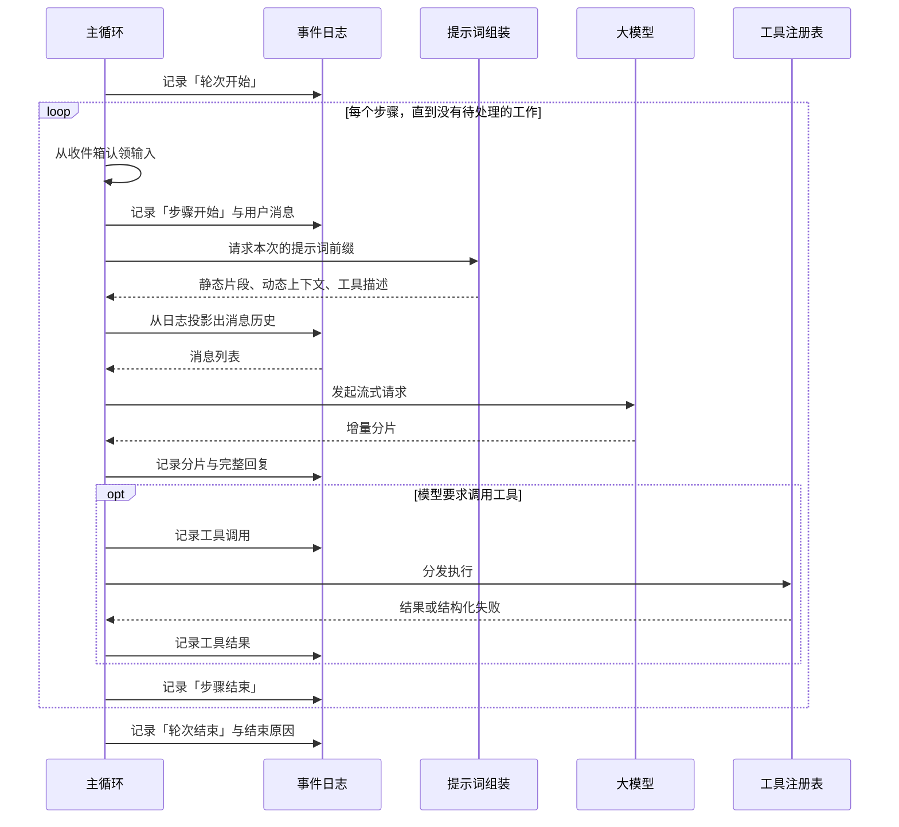

# 一、起点：agent 的内核是一个循环

抛开一切框架和术语，一个 agent 能干活，靠的只是一个循环：**拿到用户的输入，把它和历史一起交给模型，模型要么直接答复、要么要求调用某个工具；如果要求调用工具，就执行它、把结果塞回历史、再问一次模型；直到模型不再要求工具为止。**这个循环用五十行代码就能跑通第一个版本，先把它跑通，再来谈设计。

真正的设计难度不在这个循环本身，而在它周围的四件事：**状态存在哪里、消息历史怎么来、提示词怎么拼、工具怎么被看见和执行。**下面这张图是一个成熟形态的完整往返，你会发现循环还是那个循环，只是每一步都从"直接做"变成了"向某个部件要"。

图里有一条贯穿的主线值得先记住：**主循环自己不保存任何状态，它只是反复地"读日志、问模型、写日志"。**之所以要把它设计成这样，是因为 agent 有一个和普通后端服务完全不同的要求——它必须能被完整重放。用户刷新页面要看到全过程、程序崩溃后要能接着跑、上下文满了要能压缩后重试、出了问题要能复盘模型当时到底看到了什么。只要主循环里藏了一点只存在于内存的状态，这四件事就全都做不到。

> 📌 **贯穿全文的一条判据：模型看得见的，日志里必须有。**任何最终进入模型请求的内容，都必须能从日志里重新算出来；反过来说，当你想给模型多喂一点东西时，第一个动作是先给它设计一个事件类型，而不是先找个地方把它拼进字符串。这一条决定了后面所有部件的形状。

# 二、第一个决定：状态放在事件日志里，而不是一个可变的消息数组

几乎所有人的第一版都是这么写的：内存里放一个 `messages` 数组，用户说话就 push 一条，模型回复就 push 一条，工具结果也 push 一条。这个做法在你自己本地跑通 demo 时毫无问题，但会在四个地方相继撞墙。

**第一，崩溃恢复。**数组在内存里，进程一挂全没了。你会想到把它定期存盘，但存下来的是"当前快照"，你无法知道它是怎么变成这样的。**第二，界面重连。**用户换个浏览器打开，你要把执行过程重新画出来——包括每个工具调用的参数、耗时、成败——快照里没有这些。**第三，压缩后重试。**上下文超长时你要把前面几十轮摘要成一段话，如果你直接改那个数组，原始内容就永久丢失了，而摘要一旦出错就再也回不去。**第四，复盘。**用户报告"模型胡说了"，你想知道它当时的输入是什么，而数组只剩下最终态。

这四个问题指向同一个结论：**把唯一真源换成一条只能追加、不能修改的事件日志，消息历史降级成从日志算出来的派生产物。**用户说话是一个事件，模型回复是一个事件，工具被调用、工具返回结果、一个步骤开始、一个轮次结束，全都是事件。日志只增不减，于是任何时刻的状态都等于"从头重放到第 N 条"，上面四个问题同时消失。

事件信封（即每条事件公共的外层字段）建议至少包含这些内容。字段不多，但每一个都是为一类具体需求存在的：

| **字段** | **含义** | **为什么必须有** |
|-|-|-|
| 类型 | 这是哪一种事件 | 读取方靠它决定怎么处理；也是后续所有分派逻辑的依据 |
| 序号 | 在日志中的位置，从 0 递增 | 提供稳定的引用锚点：分叉、引用、断点续传都需要说"从第几条开始" |
| 时间 | 写入时刻 | 界面展示耗时、排查性能问题；不要用它排序，排序永远用序号 |
| 载荷 | 该类型自己的数据 | 类型不同则结构不同，靠类型字段区分 |
| 可忽略标记 | 读取方不认识时能否跳过 | 见下文的版本兼容策略，这是整条日志能否平滑演进的关键 |
| 来源序号（可选） | 本事件由哪几条事件加工而来 | 压缩、摘要这类"改写历史"的操作需要留下溯源链 |

**把写入口收敛成唯一一个函数，所有校验都放在那里。**这是这一层最重要的工程决定。原因是日志一旦写坏就是永久性的——它是真源，没有别的地方能纠正它。因此这个函数应当在写入前就拒绝掉：载荷里含有无法序列化的东西（函数、循环引用、类实例），位置关系不合法（比如声称要替换一段还不存在的历史），以及最隐蔽的一种——在写入过程中又触发了一次写入。

最后一条值得单独解释：如果某个监听器在收到事件通知时又追加了一条事件，序号分配和通知顺序就会交错，日志顺序变得不可预测。**直接检测并抛错，比事后调试这种问题便宜得多。**另有一个容易忽略的细节：校验和存储要在同一次遍历里完成，否则一个带取值副作用的属性可以在"被校验时"返回合法值、"被存储时"返回另一个值，绕过全部检查。

**写入成功后把事件冻结。**日志是共享的，任何一处代码顺手改了某条历史事件的字段，都会让重放结果与当时的真实执行不一致，而这种 bug 几乎无法定位。冻结的成本是一行代码。

**版本兼容要在一开始就定调，因为它不可后补。**你迟早会新增事件类型，而旧版本的读取方会遇到不认识的类型。此时只有两种选择：默认忽略，或默认拒绝。推荐**默认拒绝，让写入方显式给那些"纯装饰性"的事件打上可忽略标记**。理由是：如果默认忽略，一个携带关键信息的新事件被旧读取方悄悄跳过，结果是模型少看到了东西却没人报错，表现为难以复现的行为偏差；而默认拒绝的代价只是一个清晰的启动失败。宁可吵闹地坏掉，不要安静地算错。

# 三、第二个决定：消息历史是"投影"，不是日志的全部

有了日志之后马上会遇到一个矛盾：日志里的事件远多于该发给模型的消息。"步骤开始"不是消息，流式增量分片不是消息，工具超时的内部诊断不是消息。**所以需要在日志和模型请求之间加一层投影：只挑出会变成消息的那几类事件，按顺序拼成消息列表。**

**参与投影的事件类型要刻意保持很少**——用户消息、模型回复、工具结果，三类基本就够了。这个约束的价值在于，"某段内容会不会进入模型"变成了一眼可查的事实，而不是散落在各处拼装逻辑里的推断。每次想让新东西进入模型，你都被迫先回答"它属于哪一类消息"，这个提问本身就拦掉了很多想当然的设计。

**投影操作要支持两种：追加和替换。**追加是常态；替换是专门为上下文压缩留的出口——压缩不是删掉旧消息，而是追加一个"用摘要替换第 3 到第 47 条"的投影操作。原始事件全都还在日志里，只是不再参与本次投影。这样压缩就变成了可撤销、可审计的操作，而不是一次不可逆的破坏。

**流式分片要记，但不进投影。**模型返回时是一个个 token 流出来的，界面需要它才能逐字显示，重放时也需要它才能还原打字效果。但完整回复本身会作为独立事件记录，所以投影时跳过分片，避免同一段话被算两遍。这是"日志服务于多种读取方"的典型例子：同一条日志既要能重建模型输入，又要能重建界面表现，两者取的子集不同。

**投影结果要缓存，但缓存键不能是日志长度。**因为替换操作会改变前面的内容而不改变长度。可行的做法是维护一个"替换代数"，每发生一次替换就 +1，缓存键用它。

# 四、第三个决定：系统提示词每次现算，由多方分片贡献

第一版几乎肯定是一个大字符串模板，里面塞满身份说明、环境信息、工具用法、注意事项。它会在你加到第三个功能时开始腐烂，症状很典型：**多个互不相关的模块都要往里加内容，谁在前谁在后开始靠运气；里面的动态信息（当前目录、时间、待办列表）在长会话里逐渐过期；工具列表变化后描述没跟着变。**

解法是把提示词从"一个模板"改成"一次组装过程"：**各模块各自注册自己的片段，每次发请求前重新组装一遍。**这里有三个关键决定。

**第一，顺序必须由显式的数字优先级决定，不能靠注册顺序。**注册顺序取决于插件加载次序，而加载次序会因为配置变化、依赖关系、并发初始化而变动，于是提示词内容会莫名其妙地飘。给每个片段一个明确的数字，小的在前，是几行代码换来的确定性。规划优先级区间时留出足够间隔（比如身份说明 -100、部署方定制 0、工具指引 100 以上），后来者才有地方插入。

**第二，区分静态片段和动态上下文。**静态片段是注册时就定好的文本；动态上下文是每次组装时才调用、现场取值的函数。当前工作目录、未完成的待办、最近改过的文件都属于后者。把它们混成一类，就必然出现"长会话里模型看到的还是三小时前的目录"这种问题。

**第三，注册要返回一个卸载函数，并且成对使用。**提示词贡献者会随会话、随子 agent、随插件启停而来去。如果注册只能加不能减，你会得到一个只增不减的提示词，以及大量"上一个会话残留的上下文"污染。把卸载和创建绑在同一个生命周期上，这类问题从根上不会发生。

**另外留一个"完全接管"的出口。**有些场景（跑评测、复现线上问题、极端精简的子 agent）需要提示词就是给定的那一段，不许任何模块追加。让某个片段可以声明"我之后全部丢弃"，比让调用方去逐个关闭贡献者要可靠。

# 五、第四个决定：工具的声明、可见性与执行三段式

工具是 agent 唯一能影响外部世界的手段，所以这一层的设计密度最高。先看一个工具至少要声明什么，以及每一项分别在解决什么问题：

| **声明项** | **内容** | **解决什么问题** |
|-|-|-|
| 名称 | 模型调用时使用的标识 | 全局唯一，重名必须在启动时报错而不是后者覆盖前者 |
| 描述 | 给模型看的用途说明 | 这是模型选不选它的唯一依据，实际上属于提示词工程 |
| 入参结构 | 参数的结构化定义 | 既作为模型的调用契约，也用于执行前的校验 |
| 出参结构 | 结果的结构化定义 | 让结果可以被程序消费，而不只是拼成一段文本 |
| 面向模型的渲染 | 把结果转成模型看到的文本 | 结构化结果和模型可读文本是两件事，必须分开 |
| 面向界面的渲染 | 调用中和调用后怎么展示 | 展示形态（普通/终端/差异对比）是设计的一部分，不是事后美化 |
| 超时与并发标记 | 最长执行时间、能否并行 | 防止一个卡住的工具吊死整个轮次；并行是显式声明而非默认 |

**可见性需要分层，不能只有一张全局表。**一旦你开始做子 agent、做不同的运行模式（比如只读的调研模式和可写的执行模式），"哪些工具此刻可用"就成了一个随上下文变化的问题。可行的模型是三层叠加：全局注册一批，当前模式覆盖一批，子 agent 再收窄一批，就近的一层优先。在此之上再叠一层允许/禁止名单做交集。**禁止必须是不可逆的**——如果某一层能把上层禁掉的工具重新放开，那这套权限就等于没有。

**执行要拆成三段，而不是一个函数调用。**这是整个设计里最容易被低估的一点。三段分别是：

| **阶段** | **能做什么** | **典型用途** |
|-|-|-|
| 执行前判定 | 放行、拒绝，或要求人工确认 | 权限控制、危险命令拦截、按路径判断读写范围 |
| 环绕执行 | 包裹真正的执行过程 | 超时、重试、埋点计时、沙箱切换、把执行转发到远端 |
| 执行后处理 | 接受、改写或丢弃结果 | 超长输出截断并转存、敏感信息脱敏、结果格式统一 |

之所以要这样拆：这三件事的关注点完全不同，如果都塞进工具自己的执行函数里，每个工具都要重复实现一遍权限、超时、截断，且实现方式各不相同。**拆开之后这些横切能力只写一次，对所有工具生效，包括后来新增的工具。**其中"要求人工确认"这一档要设计成可选依赖——有界面时弹窗给用户，无界面的自动化场景下就直接按默认策略处理，而不是让整个流程卡死等一个永远不会来的回答。

**模型给的参数要用"宽容解析 + 严格校验"两层处理，这是一个容易做反的地方。**模型输出的参数是一段字符串，它有时不是合法结构（少个括号、多个逗号、干脆是一句自然语言）。第一层解析应当宽容：解析失败就原样保留那段文本、空串当作空参数，绝不在这里抛错。第二层校验则要严格：拿结构定义逐项检查，把"缺少哪个字段、哪个字段类型不对"整理成一条清晰的错误。

两层配合的效果是：**模型的格式错误不会中断循环，而是变成一条它能读懂、能自我纠正的反馈。**如果第一层就抛错，你得到的是一次失败的轮次；如果第二层也宽容，你得到的是一次带着错参数执行的工具调用——后者更危险。

**参数在执行前要冻结。**同一份参数会被三段流水线、界面渲染、日志记录多方读到，任何一方顺手改一下，就会出现"界面上显示的参数和实际执行的不是同一份"。顺带一个好处：冻结后的参数可以安全地当作缓存的键。

**界面渲染函数必须是纯函数。**因为它不只在执行当时被调用，还会在历史回放时被调用——那时工具早已执行完毕，外部状态可能完全变了，参数可能是几个版本前的格式。它只能依赖传入的参数计算显示内容，不能读全局状态、不能发请求、不能假设文件还存在。

# 六、第五个决定：循环何时停、如何被打断

前面四层都是"部件"，这一层是把它们串起来的驱动逻辑，也是唯一有状态机性质的地方。核心是两级边界：**一个轮次对应用户的一次委托，一个轮次里可以有多个步骤，每个步骤对应一次模型请求。**把这两级分开，是因为"这次委托结束了"和"这次模型调用结束了"是两个不同的时刻，界面、计费、日志分段、停止判定全都依赖前者。

**轮次的开启和关闭必须严格配对，关闭动作要放在无论如何都会执行的位置。**没有配对的轮次会导致重放时状态机对不上，而这种日志损坏是永久的。特别注意几种容易漏掉的路径：模型请求抛异常、用户中途取消、第一次认领输入就被权限拒绝、以及认领到的输入被过滤后变成空——最后两种情况下一个步骤都没发生，但轮次仍然必须被关上，只是关闭原因不同（被拒绝 / 无事可做）。**关闭时一定要带上原因**，正常完成、被中止、被拒绝、出错、超长度上限，界面和后续决策都要用它。

**输入不要直接调用循环，而是投递到一个收件箱里，由循环主动认领。**直接调用的问题是：模型正在流式输出时来了一条新消息，你无处安放它——丢弃会让用户困惑，立即插入会破坏正在进行的请求。收件箱把"消息到达"和"消息被处理"解耦，并且能表达出三种不同的投递意图：

| **意图** | **何时被消费** | **是否唤醒空闲循环** | **典型场景** |
|-|-|-|-|
| 追问 | 下一个轮次 | 是 | 用户提出新的任务 |
| 干预 | 当前轮次的下一步 | 是 | 执行途中纠正方向 |
| 注入 | 当前轮次的下一步 | 否 | 系统补充信息，不主动激活 |

"是否唤醒"这一列是这张表的关键。**注入之所以不唤醒，是因为它是系统行为而非用户意图**——比如某个后台任务完成了想告知模型。如果它也能唤醒空闲的 agent，你就得到了一个会自己开始干活的系统，这在成本和可预测性上都不可接受。

**停止判据就是收件箱空了。**不要用"模型没有要求调用工具"作判据，因为工具执行完还要把结果给模型看，而模型看完可能又有新动作。判据统一成"收件箱里没有待处理的工作"，这样追问、干预、工具结果回灌全都自然地延长循环，不需要特例。

**取消信号要合并多个来源，并且保留原始原因。**至少有三个来源会要求停止：用户主动取消、上层组件被销毁、整个运行时关停。若只是简单地合并成一个"已取消"，你就丢失了区分"用户按了停止"和"进程正在退出"的能力，而这两者在日志、界面提示和是否需要保存现场上处理方式完全不同。宁可多写十几行手工合并的代码，也不要用一个丢弃原因的便捷 API。

**模型请求出错要走可拦截的处理链，而不是就地重试。**不同的错误对应不同的恢复策略：限流应当退避重试，上下文超长应当先压缩再重试，鉴权失败重试多少次都没用。把"出错了"变成一个可以被多方监听、任一方都能返回"我处理好了，请重试"的环节，压缩、退避、降级模型就都成了可插拔的策略。**但要设一个真实进展的门槛**——只有当历史确实被改短了（压缩生效了）才允许开启新的重试，否则一次必然失败的请求会无限重试下去。

**最后，在关闭轮次之前留一个检查点。**有些工作只有在"即将结束"这一刻才知道该不该做：待办列表里还有未完成项要不要提醒模型继续、需不需要生成一句会话摘要。让监听者在这一刻有机会投递一条新消息从而延长本轮，比让它们各自去猜循环状态要稳。这个环节要串行执行，因为它们的决定会互相影响。

# 七、从 0 到 1 的落地顺序

以上五个决定不必一次做完，但顺序不能颠倒——**越靠前的决定越难后补**。建议的推进路径是：

**第一版，把循环跑通。**一个可变的消息数组、一个写死的提示词字符串、两三个硬编码的工具、循环条件就是"模型是否要求工具"。目标只有一个：亲手感受一次完整往返，知道每一步在做什么。

**第二版，换掉状态层。**这是唯一必须尽早做的重构，因为它会改变所有读取方的代码——晚做一天成本高一截。把消息数组换成事件日志加投影，把写入口收敛成一个带校验的函数，定好事件信封和未知事件策略。做完这一版，崩溃恢复、界面重连、执行回放同时具备。

**第三版，拆开提示词和工具。**提示词改成分片段贡献加显式排序，工具改成注册表加三段流水线。这一版的收益是横切能力（权限、超时、截断、审批）只写一次，之后每加一个工具都不用重复。

**第四版，补齐驱动逻辑。**加入轮次与步骤的两级边界、收件箱与三种投递语义、取消信号合并、错误处理链和关闭前检查点。到这里，可打断、可干预、可从上下文溢出中恢复才真正成立。

贯穿全程只需要守住一条判据：**凡是模型看得见的，日志里必须能找到**。每次你想绕开它图快，代价都会在几周后以"线上行为无法复现"的形式回来。
