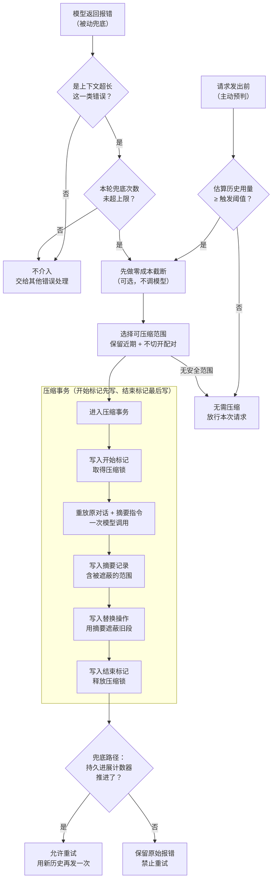

# 一、先看清问题：压缩不是"删掉旧消息"

模型的上下文窗口是一个硬上限，而 agent 的历史增长速度和聊天机器人完全不是一个量级——读一个文件几千 token，跑一次测试几万行输出，几十轮工具调用之后窗口就见底了。**所以任何要长时间干活的 agent，迟早都必须回答一个问题：历史装不下了怎么办。**

第一版方案几乎都是滑动窗口：只保留最近 N 条消息，更老的直接丢掉。它在聊天场景里勉强可用，在 agent 场景里会立刻出事。**因为 agent 的历史不是等价的——最开头那条"帮我把登录模块重构成 XX 结构，注意不要改动数据库"往往是整个任务里信息密度最高的一句，而它恰好是最先被滑出窗口的。**丢掉它之后模型会开始偏离目标、重复已经否决过的方案、违反早就说过的约束。更糟的是，如果窗口边界正好落在一次工具调用和它的结果之间，你会发给模型一段结构上非法的历史。

正确的思路是**折叠而不是丢弃**：把较早的一整段对话交给模型，让它压成一份结构化的摘要，再用这一条摘要替代原来那一整段。信息密度高的内容被保留下来，只是形态从"完整过程"变成了"结论与状态"。下面这张图是一套成熟压缩策略的完整决策流，本文余下部分就是逐个解释图里的每个决定为什么必须这样做。

> 📌 **贯穿全文的一条判据：压缩必须是一次追加，而不是一次修改。**你要往历史里追加一条摘要和一个"遮蔽旧段"的标记，而不是把旧内容从数组里删掉。这一条决定了后面所有环节的形状——它让压缩变成可回放、可审计、可撤销的操作，也是唯一能让你在摘要质量出问题时还有救的前提。

# 二、第一个决定：追加摘要并遮蔽，而不是就地改写历史

假设你手里是一个可变的消息数组，压缩最直接的写法就是：算出摘要，然后 `splice` 掉第 3 到第 47 条，把摘要塞进去。这一行代码会让你永久失去四件事。

**第一，摘要错了没有退路。**摘要是模型生成的，它会漏、会误解、会把"用户明确否决过的方案"写成"待尝试的方案"。原始内容一旦删除，你连发现问题的手段都没有——用户抱怨 agent 行为变傻时，你无法判断是压缩丢了信息还是模型自己的问题。**第二，无法回放。**你不能重建"模型在第 N 步到底看到了什么"，因为那段历史已经不存在了。**第三，无法审计成本。**压缩省下了多少 token、花了多少摘要费用，没有留痕就无法度量，也就无法调优阈值。**第四，无法演进。**你想换一套摘要提示词并对比效果，但旧会话的原始素材已经没了。

解法是把"完整历史"和"模型可见历史"拆成两个概念：**底层是一条只追加不修改的完整日志，上层是由日志算出来的、真正发给模型的可见历史。压缩只做两件事——往日志里追加摘要内容，再追加一条"从第 X 到第 Y 这段不再参与可见历史"的替换记录。**原始事件一条都没动，只是不再被投影出来。

这样一来压缩的性质就变了：它成了一次**可撤销、可审计、可重放**的操作。想回退就忽略那条替换记录；想复盘就把原始段落取出来看；想换提示词重压一次，素材还在原地。代价只是多存一份历史，而这点存储成本相比它换来的可观测性完全不值一提。

# 三、第二个决定：主动预判和被动兜底都要有

压缩的触发时机有两种可能，很多人只做一种，然后被另一种情况反复咬。

**只做被动兜底**（等模型报"上下文超长"再压）的问题是：每次触发都先浪费一次完整请求的往返和费用，用户会明显感到卡顿；更麻烦的是不同提供方对这类错误的报法不统一，有的错误码含糊，有的甚至在流式响应中途才暴露，你的兜底逻辑会变得脆弱。

**只做主动预判**（估算用量到阈值就压）的问题是：估算永远不准。你的 token 估算和提供方真实的分词器有差异，图片和多模态内容的计价规则不透明，工具定义、system prompt 这些请求外围开销容易被漏算。更极端的情况是单条输入本身就超大——用户一次贴进来十万字，还没等你估算就已经超了。

所以结论是**两条腿走路，各管一段**：

|  | **主动预判** | **被动兜底** |
|-|-|-|
| 触发点 | 每次向模型发请求之前 | 模型明确返回上下文超长错误后 |
| 判断依据 | 估算用量达到「窗口 × 阈值系数」 | 只认明确的超长错误码，其他错误一律不碰 |
| 压缩力度 | 按保留预算，温和地压 | 绕过阈值，尽力压出可用空间 |
| 失败处理 | 记警告后继续本轮，绝不打断用户 | 保留原始报错，交还给上层 |
| 承担的职责 | 日常降压，让绝大多数请求不撞墙 | 兜住估算失准和单条超大输入 |

这张表里最容易被写错的是**主动路径的失败处理**。压缩本身要调模型，也会失败（超时、限流、摘要模型不可用）。此时正确的做法是记一条警告然后**继续原来的请求**——它可能本来就能装下，压缩只是预防性的。如果你在这里抛错中断轮次，就等于让一个可选的优化措施拥有了打断用户任务的权力，这是典型的可用性倒退。

另外，阈值系数不要写死在代码里，它是随部署和模型变化的量：窗口小的模型要更早压，成本敏感的部署愿意更晚压。把它做成配置项，同时允许按具体模型精确覆盖。

# 四、第三个决定：压缩哪一段

范围选择要同时满足三个约束，缺一个都会出问题：**最近的对话必须原样保留**（模型正在处理的就是这些，压掉等于当场失忆）；**不能切开一次工具调用和它的结果**（否则历史结构非法，有些提供方直接拒绝请求）；**压完要有足够收益**（只压掉两条短消息，还不够付摘要的钱）。

一个可靠的算法是这样的：**从最新的一条消息往前走，累加它们的 token，直到累计量达到「保留预算」——这条线之后的内容全部原样保留。然后把这条线继续往前挪，直到落在一个"工具调用与结果配对完整"的位置上。最终压缩范围就是从历史最开头一直到这个切点。**

这里有几个决定值得解释。**为什么范围总是从最开头算起（头部锚定），而不是压中间某一段？**因为越老的内容其"过程细节"价值衰减越快，而摘要恰好擅长保留结论、丢弃过程。头部锚定还有一个实用好处：多次压缩会自然形成"一条不断更新的摘要 + 一段最近的原始对话"这种稳定形态，而不是历史里散落着一堆碎片摘要。

**为什么保留预算按窗口比例算，而不是固定保留多少条消息？**因为消息长度差异极大——十条闲聊和十条测试输出可能差两个数量级。按条数保留，你要么在长消息场景下依然超窗，要么在短消息场景下浪费空间。按 token 预算是唯一稳定的口径。

**保留预算必须小于触发阈值，而且这条约束要在配置加载时就校验。**如果有人把保留预算配得比阈值还大，压缩会陷入"每次都触发、但每次都发现没什么可压"的空转。这种矛盾配置应当在启动时就明确报错，而不是等到线上表现异常再去排查。

最后，**找不到安全范围时要老老实实返回"本次不压"**，不要为了腾空间去切开配对边界或者把最近的内容也压掉。如果确实是一条单独的超大消息撑爆了窗口，那已经超出压缩能解决的范围了，应该在更上层报错给用户，而不是让压缩做出破坏性的妥协。

# 五、第四个决定：摘要怎么生成才既便宜又不失真

摘要本身是一次模型调用，它有成本、有延迟、也会失败。这一节讲三个能显著改变成本和质量的设计选择。

**第一个选择：摘要用哪个模型。**默认跟随会话当前使用的模型，不要另外指定一个便宜的小模型。原因是摘要质量直接决定压缩之后 agent 还能不能干活——小模型漏掉一条关键约束，代价是后面几十轮全部跑偏，远比省下的那点摘要费用贵。真要优化成本，应该去调阈值和保留预算，而不是降摘要模型的档次。当然要允许按模型单独覆盖配置，因为不同窗口大小的模型适合的策略不同。

**第二个选择也是最容易被忽略的一个：怎么把摘要请求拼出来。**直觉写法是新建一个请求，system prompt 写"你是一个摘要助手"，然后把要压缩的历史贴进去。这样能work，但它**浪费了一次完整的缓存命中**。

提供方普遍按**请求前缀**做 KV 缓存：如果本次请求的开头一大段和上次完全一样，这部分就不必重新计算，价格和延迟都显著低于全新 token。而你刚刚发过的那次对话请求，其 system prompt、工具定义、消息历史正好就是一个已经缓存好的长前缀。**所以正确做法是：完整重放原对话的 system prompt、工具定义和消息，然后仅在最后追加一条 user 消息，内容是摘要指令。**这样摘要请求就是上一次请求的真前缀延伸，缓存全部命中，只有那条指令是新 token。这一个改动通常能把摘要成本降低一个数量级。

**第三个选择：摘要指令怎么写。**不要写"请总结上面的对话"——模型会给你一段流畅但对干活毫无用处的散文。要给一个**固定的分节结构**，让它按格填空。一套经过验证的分节是：

- **用户的原始诉求与意图**——最重要的一节，必须逐项保留用户的明确要求，包括中途的修正和否决
- **关键技术概念**——已经确定的技术选型、术语、约定
- **涉及的文件与代码**——精确路径、做了什么改动、必要的关键片段
- **遇到的报错与修复**——错误现象、根因、最终解法，以及用户对修复方式的反馈
- **未完成的工作**——已经明确要做但还没做的事
- **当前正在做什么**——被压缩打断的那一刻，手上的动作是什么
- **下一步**——只允许写能从上文直接推出的下一步，禁止自行发明新任务
- **不可丢失的上下文**——放不进以上分节但丢了就会出错的信息

配套还有几条指令的价值远超它们的长度。**强制"某一节为空时也要保留标题并写明无内容"**，否则模型会悄悄删掉空节，你就分不清是"确实没有"还是"忘了写"。**明确禁止模型在摘要里提及压缩这件事**，否则它会写出"由于上下文限制，之前的对话被总结如下"这类元叙述，让后续的模型开始讨论自己的记忆机制而不是干活。**明确禁止在生成摘要时调用工具**，它的任务是整理已有信息，不是去补充调查。

还有一条针对多次压缩的：**如果待压缩的历史里已经包含上一份摘要，必须要求模型把它"合并更新"而不是"照抄一遍"。**否则第二次压缩会产出"摘要里嵌套着旧摘要"的结构，几轮之后这份摘要自己就成了新的膨胀源。

最后，摘要写回历史时**要加一句引导语并用标签包裹**，比如"以下是此前对话的记录，请据此继续任务"。裸着放进去，模型容易把它当成用户刚发的新指令；带引导语则会被理解为既定背景。用固定标签包裹则让你后续能程序化地识别它——判断是否已存在检查点、提取它做二次压缩，都依赖这个标记。

# 六、第五个决定：怎么保证压缩不会变成死循环

这是整套设计里最容易埋雷的地方，值得单独一节。

被动兜底路径天然是一个循环：报超长 → 压缩 → 重试 → 可能又报超长。**如果重试条件写成"压缩函数没抛错就重试"，你会得到一个无限循环**：某些情况下压缩确实"成功执行"了，但历史长度没有实质变化——比如范围选择只找到两条短消息可压，或者摘要本身长度和原文差不多。于是重试、再报超长、再压缩、再重试，模型账单飞涨而用户只看到一直转圈。

**正解是：重试的判据不能是"压缩执行成功"，而必须是"历史确实发生了持久的改变"。**具体做法是维护一个计数器，它**只在一次替换操作真正落到日志里时才递增**。兜底逻辑在压缩前记下这个计数器的值，压缩后再读一次——只有数值真的推进了才允许重试，否则就把原始的超长错误如实返回给上层。

这个设计的关键在于它把判据从"我调用了压缩"换成了"世界真的变了"。任何一种"压缩空转"的情形都会自动被这个门卡住，你不需要枚举所有空转的原因。

在此之上还需要三道配套的护栏。**每轮任务的兜底重试要有次数上限**，通常一次就够——压完还超，说明问题不在历史长度上。**拿到成功响应后要重置这个计数**，否则长会话跑到后面会因为累计了历史上的重试次数而失去兜底能力。**主动路径的"压完仍超阈值"也要有重试上限**，超了就停下并如实上报，而不是继续压到把最近的对话也吃掉。

还有一个容易漏的细节：**用户主动取消永远优先于压缩重试。**任何一个判断点上，只要发现本轮已被取消，就立刻停止，不要"顺手把压缩做完"。压缩是为当前请求服务的，请求都没了，压缩就没有意义，还会污染一个即将结束的会话。

# 七、更重要的一件事：压缩之前先用掉两层更便宜的手段

如果只做 LLM 摘要，你会发现它触发得比预期频繁得多——因为大部分膨胀根本不是"对话太长"，而是**少数几条工具输出太大**。一次 `grep` 可能返回几万行，其中真正有用的是开头几十行。对这种情况上摘要是用最贵的手段解决最简单的问题。

成熟的做法是**分三层，从便宜到贵依次用尽**：

| **层次** | **做什么** | **成本** | **什么时候做** |
|-|-|-|-|
| 转存 | 超大工具输出写到外部存储，历史里只留一段预览和一个取回句柄 | 近乎为零，无模型调用 | 工具执行完的那一刻，还没进历史之前 |
| 截断 | 按字符数保留头部和尾部，中间用标记替换 | 零，纯规则 | 压缩流程开始时，选范围之前 |
| 摘要 | 把整段历史交给模型压成结构化检查点 | 一次完整模型调用 | 前两层都不够时 |

三层的顺序不能颠倒，因为**每一层都在给下一层减负**：转存让超大输出根本不进入历史；截断把剩下的中等输出削到可控；摘要只需要处理"真的是对话本身太长了"这种情况。反过来，如果先摘要，你是在花钱让模型去读一堆本来就该被截掉的日志噪音。

截断层有两个参数值得留意。**头部要留得比尾部多**——工具输出通常前面是最相关的匹配、后面是收尾统计，所以典型配比是头部留几千字符、尾部留一千字符左右。**中间被删掉的地方必须留一个显式标记**，让模型知道"这里有内容被省略了"，而不是误以为自己看到的是完整输出——后者会导致模型基于不完整信息下结论。

# 八、从 0 到 1 的实施顺序

**第一版只做一件事：把可见历史从完整日志中投影出来。**此时不做任何压缩，投影就是全量。这一步的价值不在压缩，而在于把"追加日志"和"发给模型的历史"这两个概念分开——后面所有能力都建立在这个分离之上，而如果第一版就把它们混成一个数组，将来的改造成本会非常高。

**第二版做工具输出截断。**纯规则、零模型调用、无需摘要基础设施，却能解决实践中最大比例的膨胀问题。做完这一版，很多任务已经不需要压缩了。

**第三版做手动触发的摘要压缩。**提供一个显式命令让用户主动压缩，把摘要指令、追加摘要、写替换记录这条链路完整打通。手动触发的好处是你能反复观察摘要质量、迭代提示词，而不用同时调试触发时机。

**第四版接上主动预判。**加入用量估算和阈值判断，在请求前自动触发第三版的链路。此时务必把"压缩失败不打断请求"这条写对。

**第五版接上被动兜底。**识别上下文超长错误、加上持久进展计数器作为重试门、加好各处的次数上限。这一版之前你的系统已经可用，这一版之后它才算健壮。

**第六版再考虑转存。**它需要外部存储和取回工具，是三层里工程量最大的一层，但也是收益最确定的一层——放到最后做是因为它可以完全独立于前面所有环节，不必让它阻塞主线。

贯穿所有版本有一条纪律值得反复强调：**压缩的每一步都要在日志里留痕**——什么时候开始、压了哪一段、省了多少 token、摘要花了多少、什么时候结束。压缩是一个会静默改变模型行为的机制，没有这些记录，它出问题时你几乎没有排查的入口。
