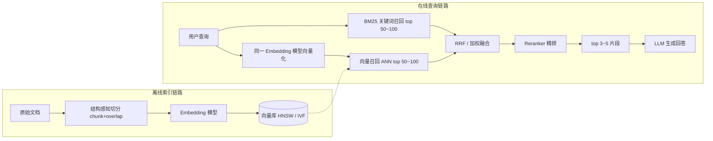

向量化(Embedding)是 RAG(Retrieval-Augmented Generation,检索增强生成)系统中最底层的一环：它把文本变成高维浮点向量，让"语义是否相近"变成"距离是否够近"，从而可以像查数据一样查语义。检索是 RAG 的地基，向量化是检索的地基——模型再强，检索拿不到相关上下文，回答就只能靠编。

开发人员需要掌握的知识，可以归结为下面六个方面。先看全景：离线阶段，文档经过切分、向量化后写入向量库；在线阶段，用户查询用同一个模型向量化，经 ANN 召回、与关键词召回融合、精排后，把最相关的片段交给 LLM 生成回答。

# 一、Embedding 模型：选型与一致性

Embedding 模型本质是一个双塔(bi-encoder)编码器：把任意文本独立编码成固定维度的向量，让语义相近的文本在向量空间里彼此靠近。它不做生成，只负责"把语义压进一个点"。工程上要记住的第一条纪律是：**查询和文档必须用同一个模型、同一个版本向量化**。不同模型的向量空间互不相通，维度恰好一样也不行；模型升级后必须全量重建索引，常见做法是新旧双库并行，灰度切换后下线旧库。

选型按这几个维度权衡：中文/多语言效果(看 C-MTEB、MTEB 榜单但不迷信，最终用自己业务数据评)、向量维度(越高表达力越强，存储和计算成本也线性上涨，部分模型支持降维)、最大输入长度(决定 chunk 尺寸上限，超长会被截断且截断部分对向量没有贡献)、推理成本与延迟(自托管 GPU 还是调 API)、license 与数据合规。BGE(M3)、Qwen3-Embedding、OpenAI text-embedding-3 系列是当前常见选择。

| 模型 | 维度 | 最大输入(token) | 特点 |
|-|-|-|-|
| bge-m3 | 1024 | 8192 | 开源,多语言,同时输出稠密+稀疏+多向量 |
| bge-large-zh-v1.5 | 1024 | 512 | 开源中文经典款,适合短文本 |
| text-embedding-3-large | 3072 | 8191 | 闭源 API,支持降维(Matryoshka) |
| text-embedding-3-small | 1536 | 8191 | 闭源 API,成本低一档 |
| qwen3-embedding | 1024~4096 | 32k | 开源,0.6B/4B/8B 三档,支持指令化 |

表中数字会随版本变化，以官方文档为准。另一个容易忽略的点：部分模型(如 BGE instruct 系列、Qwen3-Embedding)支持给查询侧加 instruction(如"为这个问题检索相关文档")，文档侧不加，用法要严格跟模型文档一致，用对了能白拿几个点的召回提升。

# 二、相似度度量：余弦、内积与 L2 的关系

向量召回靠"算距离"。三种度量需要分清：**余弦相似度**衡量方向一致性，取值 [-1, 1]，越大越相似，对向量的模长不敏感；**内积(点积)**同时考虑方向和模长，数值无上界；**欧氏距离(L2)**衡量空间直线距离，越小越相似。当所有向量都做过 L2 归一化(长度变为 1)后，三者单调等价：cos = dot，L2 距离的平方 = 2 - 2·cos。所以很多系统(包括 FAISS、ES)干脆把向量统一归一化，然后只用内积算，一套索引支持全部语义。

关键在一致性：选了某种度量，建索引和查询时就必须用同一种，换度量等于换了空间，结果全错。模型训练时的训练目标也决定了对齐哪种度量——BGE 系列传统上按余弦对齐，text-embedding-3 官方推荐内积(不归一化时，它编码了"自信度"信号)。不确定就归一化 + 余弦，这是最不会出错的选择。

还有一个实用概念是**相似度阈值**：把"最相似的 top-k"变成"相似度超过 τ 的才进上下文"，用来挡掉不相关召回、支持"知识库里没有"的拒答场景。阈值没有普适值，不同模型分数分布差异极大(有的模型正常召回只有 0.4，有的是 0.8+)，必须在自己的数据上标定，并且模型一换就重标。

# 三、向量索引与检索：为什么是 ANN

精确最近邻(NN)要在全库做暴力比较，百万级向量 × 每次查询都算一遍，延迟不可接受。工程上全部用**近似最近邻(ANN)**：牺牲一点召回率换几个数量级的速度，它保证"大概率命中 top-k"，不保证 100% 精确。需要掌握两类主流索引：

- **图索引(HNSW)**：把向量组织成多层跳表式的近邻图，查询从顶层粗定位、逐层下沉。优点是召回率高、查询快、支持增量插入；代价是内存占用大、构建慢、删除是软删。是当前绝大多数场景的默认选择。
- **倒排文件索引(IVF 系列)**：先用 K-means 把向量聚成 nlist 个桶，查询只扫描离查询向量最近的 nprobe 个桶。优点是内存省、支持批量构建；缺点是召回依赖 nprobe，设小了桶边界附近的向量容易漏。

两个参数决定召回-速度-内存的三角平衡：HNSW 的 ef_search(查询时候选队列长度，越大越准越慢)，IVF 的 nprobe(扫描桶数)。这是线上最容易调的旋钮——效果不好先调大，延迟不行再压回来。选型上，FAISS 是库(要自己管存储)，Milvus/Qdrant/Weaviate 是专用向量数据库，Elasticsearch/OpenSearch/PGVector 是在既有系统上加向量能力；数据量在几十万级以内时，PGVector + HNSW 往往就够，不必急着引入独立组件。

召回率必须量化监控：抽一批查询，用暴力搜索算精确 top-k 作为基准，对比 ANN 返回的重合比例。没有这个数字，索引参数调优就是盲调。

# 四、Chunking：切分质量决定召回上限

切分(chunking)常被当成预处理小事，实际上它决定了召回的天花板——向量再准，chunk 本身语义破碎、或者把两个主题揉在一起，召回和生成都救不回来。核心原则是**一个 chunk 一个语义单元**：按标题层级、段落边界切，而不是死板的固定字符数；相邻 chunk 留 10%~20% 重叠(overlap)，防止关键句正好被切断；chunk 尺寸与 Embedding 模型的最大输入长度匹配，一般几百 token 起步，再按检索效果调。

纯文本 RAG 的 chunk 是平面的，但真实文档是结构化的，有两个进阶手段收益明显。一是**父文档检索 / Small-to-Big**：用小块(一两句话)做检索精度高，命中后回捞它所属的大块(整节甚至整章)给 LLM，上下文完整，小块索引、大块生成。二是**元数据附加**：切块时把文档标题、章节路径、时间、来源、权限标签等一起存进 chunk 的 metadata，检索时可做过滤(只搜某产品线、某时间段的文档)，也可拼进生成提示词让 LLM 知道出处。表格、代码块、列表要在解析阶段保持完整，不要从中间切断。

# 五、混合检索与重排：纯向量召回不够用

向量检索的天然盲区是**精确匹配**：型号、错误码、API 名、人名、专有缩写——这些 token 在 Embedding 空间里是"普通语义"，"ORA-00600"和"ORA-00601"的向量几乎一样近，但答案天差地别；低频专有名词在训练语料里见得少，向量表达也弱。所以生产级 RAG 基本都是**混合检索(hybrid search)**：向量召回负责语义泛化("退货规则"能召回"七天无理由退换")，BM25 关键词召回负责精确匹配，两路结果用 RRF(Reciprocal Rank Fusion，按排名倒数融合)或加权分数合并，不依赖两边分数可比。

再往上是**Reranker(重排)**。Embedding 是双塔结构，查询和文档各自独立编码，快但粗；Reranker 是 cross-encoder，把(查询， 文档)拼在一起过模型，直接输出相关性分数，准但贵——只能对少量候选算。标准姿势是漏斗：向量+关键词双路各召回 top 50~100 → 融合 → Reranker 精排 → 取 top 3~5 进上下文。粗排管"别漏"，精排管"别错"。常见选型：bge-reranker 系列开源可自托管，Cohere Rerank 是 API。这一层通常是 RAG 效果提升性价比最高的一步。

# 六、评测与迭代：没有指标就没有优化

向量化链路的优化必须建立在一套可复跑的评测集上，否则每次调参都是凭感觉。评测分两层。**检索层**单独评：构造"查询 → 应命中的标准 chunk"标注集，看 Recall@k(前 k 个里命中了多少，考察粗排别漏)、MRR / NDCG(相关结果排得越靠前分越高，考察排序质量)、Precision@k(前 k 个里有多少是相关的，考察别错)。**生成层**评端到端：RAGAS 之类的框架提供 faithfulness(答案是否忠于检索内容，考察幻觉)、answer relevance(答案是否切题)、context precision / recall(检索内容是否相关且够用)。检索指标不动，生成指标不会好；生成指标差，先看检索层归因。

常见的坑按出现频率排：查询和文档用了不同模型或不同预处理(必须统一)；忘了归一化却换了度量方式；chunk 切得太碎，单块信息量不足以支撑回答；只有向量一路，专有名词召回全丢；阈值照抄别人的配置；索引参数从未调过，ef_search/nprobe 用默认值；文档更新后没有同步重建索引，线上一直在搜旧版本知识。每一条都值得在 code review 和故障复盘时对照检查。

迭代的顺序也有讲究：先用真实用户查询补评测集 → 定位检索层指标瓶颈 → 按"chunking → 模型 → 索引参数 → 混合检索 → Reranker"的顺序逐项试验、单项变量、复跑评测。一次改多处，指标涨了不知道归功谁，跌了不知道怪谁。

---

**一句话总结**：向量化不是"调个 API"就完事，而是一条"模型一致 → 度量一致 → 切分合理 → ANN 参数调优 → 混合召回 + 精排 → 持续评测"的工程链路；每个环节的一致性和可度量，决定了 RAG 最终的回答质量。
