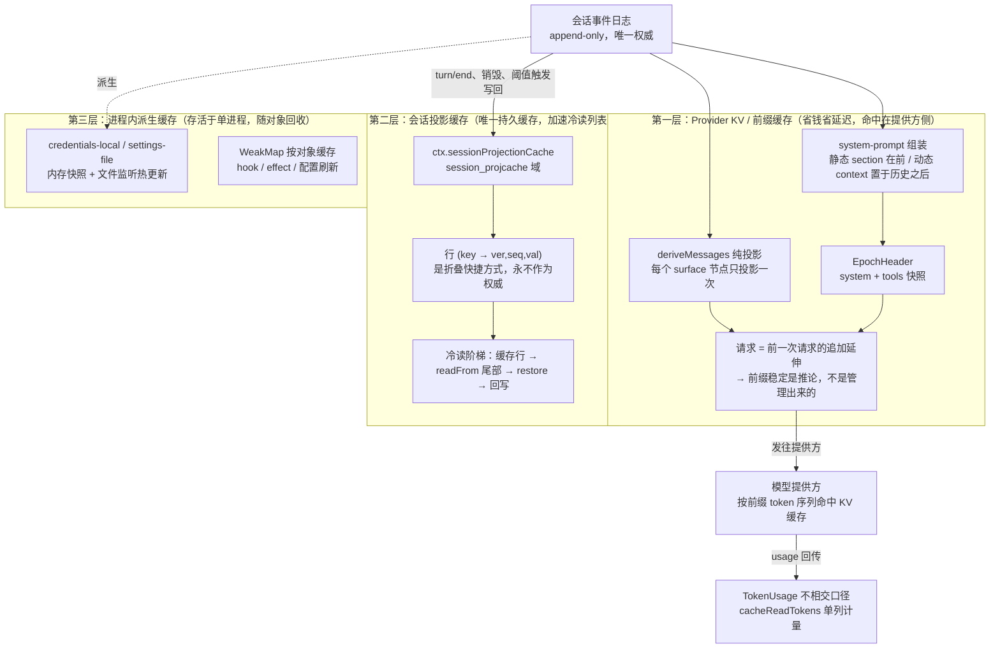

# 一、总览：一条原则统领三层缓存

缓存能力分散在三个层次，但它们全部服从同一条地基原则——**会话事件日志（append-only）是唯一权威，所有缓存都只是从日志派生出来的"快捷方式"，可以过时、可以丢失、但永远不会给出错误的值。**理解了这一条，三层缓存的失效策略、写回时机、fail-soft 行为就都是它的自然推论。

三层各自解决不同的成本问题，作用域和生命周期完全不同：

| **层次** | **缓存的是什么** | **命中在哪里** | **生命周期** |
|-|-|-|-|
| Provider KV / 前缀缓存 | 模型请求的前缀 token 序列 | 提供方服务端 | 随提供方缓存窗口 |
| 会话投影缓存 | 每个会话的投影单元状态 | 宿主端，持久化到存储域 | 跨进程重启存活 |
| 进程内派生缓存 | 派生消息、凭据/设置快照、按对象的 hook | 单个进程内存 | 随进程或对象回收消亡 |

其中**只有会话投影缓存是真正的持久缓存**；第一层的命中发生在提供方那边，项目做的是"让请求天然可被缓存"；第三层是纯粹的进程内优化。下面逐层讲清楚每一层的技术实现。

# 二、第一层：Provider KV 缓存——靠"可重建请求"自然得到，而非管理

这是本项目在缓存上投入最多设计的地方，但它的精髓恰恰是**不去主动管理缓存**。提供方（DeepSeek 等）普遍按请求开头的 token 序列做 KV 缓存：若本次请求的前缀和上一次完全一致，这段前缀就不必重新计算，价格和延迟都远低于全新 token。项目要做的只有一件事——让每一次请求都成为上一次请求的"追加延伸"，前缀自然就稳定，缓存自然就命中。

## 2.1 地基：append-only 日志 + 纯投影，让前缀稳定成为推论

Agent Note《Every LLM request is reconstructable from the session log》确立了统领性契约：**模型可见 ⟺ 可从日志重建**。任何进入模型请求的内容，都必须能从会话日志加上它引用的内容寻址对象里逐字节重建出来。

这条契约有一个被明确点出的"推论一"：**前缀缓存的稳定性是涌现出来的，不是管理出来的。**因为日志是 append-only 的，而 `Session.deriveMessages()` 是对日志逐节点的纯函数投影——每个 surface 节点只在第一次出现时通过 `deriveEventMessage(event)` 投影一次，之后复用。于是只要请求头（system + tools）没变，新一轮请求在结构上必然是上一轮请求的追加延伸，前缀逐字节一致。项目不需要写任何"缓存管理"代码，稳定性是日志模型免费带来的。

`deriveMessages()` 自身也是缓存的：投影结果按节点缓存，每次调用返回一份浅拷贝新数组，但底层是共享的、深度冻结的 `Message` 对象——想通过投影去改写历史会直接抛错。只有当 surface 被重写（一次压缩的 `replace`，即 `SurfaceManager.replaceGeneration` 前进）时才重建。

## 2.2 请求头快照：EpochHeader 决定前缀何时"换代"

`EpochHeader` 记录请求的非历史状态：调用配置、渲染后的 system prompt、工具 schema。每一步都写一份完整快照的 `request/header` 事件（首次 `initial`、恢复 `resume`、轮内变化 `change`），`foldRequestHeader` 取最新一份。**只要 header 不变，前缀就跨轮稳定；一旦 system prompt 或工具集真的变了，header 换代，缓存从第一个变化的 token 起失效——这正是我们想要的语义：内容真的变了才该重算。**

## 2.3 system prompt 的静态/动态二分：为缓存安全而设计

system-prompt 包把提示词贡献切成两类，这个二分本身就是为缓存安全服务的：

- **静态 `PromptSection`**：按 `order` 升序拼接，放在请求最前端。约定 `-100` 是 harness 身份、`0` 是部署人格、工具引导用 `100–199`。这部分构成稳定前缀，README 明确标注其 KV Cache effect 为"identity、persona、变量、section 文本与顺序渲染一致时前缀稳定；任何改动都可能从第一个变化的 token 起使复用失效"。
- **动态 `PromptContext`**：它是"cache-safe 的对应物"，agent-loop 把它的完整快照记录在**保留的模型历史之后**，且仅在它发生变化或被压缩移除时才重记。把易变内容放到历史尾部而非前端，就不会污染前缀——这是全项目 KV 缓存设计里最关键的一个摆放决定。

## 2.4 工具 schema：可见集合与顺序不变即前缀稳定

工具 schema 也是被缓存前缀的一部分。README 记录：可见 schema 集合、渲染与顺序不变时前缀稳定；注册、限制（restriction）或重排都可能从第一个变化的 schema token 起使复用失效。所以限制某个工具会移除它整段 schema 成本，但也改变了缓存形状——这是一个需要权衡的动作，而非免费优化。

## 2.5 最精彩的一段：压缩摘要如何不破坏 KV 缓存

自动压缩发生在对话中途，恰好是提供方刚刚用"上一次请求（system + tools + 派生历史）"暖好 KV 缓存的时刻。**早期实现踩了一个典型的坑**：摘要调用另起一个请求，用一段专门的摘要 system prompt 开头，后面跟被压缩的历史。由于提供方按开头 token 序列缓存，一个不同的 system prompt 会让整段缓存前缀失效——于是每次压缩都要为整段历史付两遍全额 prompt 处理费，恰恰在对话最长的时候把缓存打没了。

Agent Note《The summarization call replays the conversation prefix for KV-cache reuse》记录了修复决策：**把摘要指令从请求"开头"（一个新的 system prompt）挪到对话"末尾"（最后一条 user 消息）。**具体实现是 `buildSummarizationInput` 从 `session.requestHeader()` 取出原封不动的 system 与 tools，加上被遮蔽区间经 `deriveEventMessage` 投影出的、与路由请求逐字节一致的 `Message`，构成 `SummarizationInput { system?, tools?, messages }`；`summarizeWithLlm` 再在末尾追加一条内容为 `COMPACTION_INSTRUCTION` 的 user 消息。这样摘要调用就是暖请求的"真前缀延伸"，缓存全部命中。

几个容易忽略的细节，Note 里都明确拒绝了看似更省的替代方案：

- **不能只换个摘要 system prompt 而复用其余**——system 槽正是提供方缓存的第一段 token，换掉它整段前缀作废。
- **不能只发被遮蔽区间而省掉 system/tools 头**——头不同则从第一个 token 就分叉，缓存同样命不中。
- **不能因为摘要用不到工具就省掉 tools**——工具 schema 是被缓存 token 序列的一部分，省掉它会让后续每个 token 错位，反而破坏复用。

Note 还界定了复用的边界：自动压缩总是锚定在 surface 头部，被遮蔽区间就是路由请求的头部，前缀精确匹配——这是保证命中的情形。手动的中段 `compactRegion` 仍会重放真前缀以保证正确，但因遮蔽区间不是请求头而放弃复用；配置了与对话路由不同的 `summarizationProvider`/`summarizationModel` 也会放弃复用——这是部署方明确的取舍，不是缺陷。**一句话：缓存复用是尽力而为，正确性不是。**

## 2.6 命中的度量：TokenUsage 的"不相交口径"

缓存命中要能被观测。项目在 `TokenUsage` 上定了一个刻意的口径：**各项计数互不相交**——`inputTokens` 只算未命中缓存的输入，命中的缓存输入单列在 `cacheReadTokens`/`cacheWriteTokens`，计费输入等于三者之和。这样"这次请求到底命中了多少缓存"就是一个可以直接读出的数字。

问题在于不同提供方的上报口径不一致。DeepSeek 的 `prompt_tokens` 是**包含**缓存命中的（`prompt_tokens = prompt_cache_hit_tokens + prompt_cache_miss_tokens`）。所以 `llm-deepseek` 的 `mapUsage` 会把 `prompt_cache_hit_tokens`（或 `prompt_tokens_details.cached_tokens`）从 `inputTokens` 里减出去，落进 `cacheReadTokens`，以符合项目的不相交约定。`token-meter` 再对这些字段做投影与跨轮累加，前端 trajectory 视图据此展示每轮的 cache read。**适配器负责翻译各家口径，度量口径本身由项目统一。**

## 2.7 一条被门禁强制的纪律：每个包都要声明自己的 KV Cache 影响

KV 缓存在本项目不是某一个模块的私事，而是**全仓库强制声明的契约**。约 215 个包的 README 都带有 `#### KV Cache effect` 小节，由 `scripts/verify-package-readme-model-experience.ts` 这个 doc-sync 门禁校验其存在与格式。它的设计动机记录在 Agent Note《package model experience contract》里。

这条纪律的价值在于：任何一个新增或改动的包，作者都必须回答"我会不会影响模型请求的前缀、进而影响 KV 缓存"。不影响的包（比如纯浏览器端 UI、类型原语）显式写明"None"并给出审计理由；影响的包则要说清自己在什么条件下前缀稳定、什么改动会使复用失效。**缓存安全因此从"某人记得注意"变成了"提交时必须过的门"。**

# 三、第二层：会话投影缓存——全项目唯一的持久缓存

这是 `ctx.sessionProjectionCache`（`@deepseek-ai/dsh-session-projection-cache`），也是项目里唯一一个跨进程重启存活的缓存。它要解决的成本问题是：会话列表页需要展示每个会话的派生状态（标题、各种投影单元），如果每次冷读都要从头重放整条日志，列表会很慢。

## 3.1 键、值与"永不作为权威"的定位

缓存以 `SessionId` 为键，每个会话一条记录，落在 `session_projcache` 存储域（json 后端会把它放在存储根下 `workspace.json` 旁）。记录内是若干行 `(key → {ver, seq, val})`，每行是一个投影单元的折叠快照。

README 把定位讲得很直白：**一行存储是折叠的快捷方式，永远不是权威——它可能过时（`seq` 精确说明过时到什么程度），但绝不会错。**这个定位推导出实现承诺的全部行为：

- **每次后台写都是 fail-soft。**写失败只记一条警告、让缓存保持过时，下一次写或下一次冷读自愈；两次写之间崩溃，代价只是下次多重放一段尾部，绝不会得到错误的值。
- **`ver` 与活单元的 `stateVersion` 不匹配时直接丢弃，绝不迁移。**单元版本一 bump，旧行在读取时作废，该 key 从日志重折叠。
- **整记录写入。**每次写替换会话的完整检查点，经无损 JSON 边界快照；违反纯 JSON 约定的单元状态会当场报错。
- **记录绑定的是日志生命周期，不只是 id。**每条记录存下它折叠自的 header 身份（`createdAt`、`cwd`），每次读取都校验；一个被删后重建的 id、或换了持久化存储却残留的旧缓存，都会因身份不符而丢弃，不会喂出幻影值。
- **日志先行，缓存跟随。**活检查点在缓存行落盘前先把会话缓冲事件持久化，所以崩溃只可能让缓存落后于日志（多重放一段），绝不会超前于日志。

## 3.2 写策略：两个强制点 + 中间节流

写回不是每个事件都做，而是"两个强制点、中间节流"：

| **触发** | **性质** |
|-|-|
| `turn/end` | 强制——轮末值正是冷读最想要的 |
| 会话销毁（detach） | 强制——由活转冷的时刻，此后由冷读阶梯服务 |
| `writeEveryEvents` 个已提交事件 | 配置节流（按计数），示例值 200 |
| 距首个脏事件 `writeIntervalMs` | 配置节流（按时间），示例值 5000ms |

两个 `Config` 字段都是必填、无默认值：写回节奏是部署选择，没有普适正确值，必须在 cordis.yml 里明确写出。

## 3.3 冷读阶梯：happy path 上零全量日志加载

读分两级。列表读 `cachedSnapshot(meta)` 是"零 I/O"级：直接从身份匹配的存储记录里取整值（只取版本匹配的行），返回一个带 `asOfSeq` 的 cut——`asOfSeq` 是最低的已服务行水位，让客户端在"高 seq 胜出"的规则下永远不会用过时的列表块覆盖更新的推送帧。没有可用记录时返回 `undefined`。

真正打开会话时走 `coldSnapshot(id)` 的读阶梯，happy path 上不做全量日志加载：**缓存行 → 由最低可用水位锚定出的 `restoreFloor` → 持久化 `readFrom(id, floor)` 读尾部 → 注册表 `restore` 重折叠 → fail-soft 回写**。这个 floor 锚点让"被裁短的日志"（崩溃修复截断）可被证明：一条越界的行会精确触发一次从 seq 0 的全量重读，而不是喂出幽灵值。

## 3.4 已知边界

README 诚实列出了它不做的事：**没有淘汰/保留机制**，记录按会话累积，清理是带外维护；**interval 节流是每会话粗粒度的**，稳定的次阈值涓流是每间隔写一次而非滑动窗口；**`coldSnapshot` 不去重**，两个并发冷读各跑一遍阶梯、最后写回者胜（行等价，可接受）。

# 四、第三层：进程内派生缓存

这一层是纯粹的单进程内存优化，不持久、随进程或对象回收消亡。

## 4.1 凭据与设置的文件快照 + 热更新

`credentials-local` 与 `settings-file` 是一对刻意对称的实现，都把文件解析结果缓存在内存里并支持热更新：

- **内存快照整份替换。**`LocalCredentialProvider` 用一个 `Map<string, string>` 存解析后的凭据，每次 reload 整份替换，所以一个被删掉的条目绝不会残留在内存里。
- **文件监听 + 去抖。**用 chokidar 监听文件，配置 `watch`（默认 true）与 `debounceMs`（默认 100）；外部编辑会热发布到订阅方。
- **自写抑制。**缓存里保留一份"上次读到或写入的原始文本"，监听事件若内容与缓存相同即为 no-op，这既是自写抑制也是无谓刷新的过滤。
- **串行操作链。**用一条 Promise 队列把监听 reload 与行编辑串起来，一次只跑一个，杜绝"编辑正从一份被并发 reload 替换的文本渲染"的竞态。销毁时先拒绝新操作再排空在途操作，保证不再有任何东西在销毁后发布。

## 4.2 WeakMap 按对象缓存

项目多处用 `WeakMap` 做"按对象"的缓存，共同优点是键对象被 GC 时缓存自动清理，无需手动失效：客户端 `web-react` 的 `projectionHookCache` 缓存每个 info 的投影 hook，避免跨渲染重复订阅；vendored cordis 的 `effectInertia` 跟踪 effect 的 disposer；vendored hmr 的 `configRefreshes` 跟踪每对象的配置刷新实例。客户端还有一个投影值存储（`projection-store`），按"高 seq 胜出"更新，过时基线无法覆盖更新帧——宿主是唯一的计算方，客户端不做域折叠。

# 五、刻意不做的缓存

看清项目**不**缓存什么，同样是理解其策略的一部分。以下几处经确认没有缓存，都是有意为之：

- **web 提供方（search/fetch）没有 HTTP/响应缓存**——每次搜索或抓取都是实时请求。
- **工具 / schema / MCP tool list / skill catalog 没有落盘缓存**——skill 有根目录监听但没有显式 catalog 缓存。
- **SQLite 没有 prepared statement 缓存层**。
- **LLM 响应本身不缓存**——这属于提供方的职责，`llm` 服务只保留组装好的请求前缀并透传给适配器，README 明确写"本服务不含重试、缓存或限流"。

这些"不做"背后是一致的判断：缓存要么归属更合适的一方（响应归提供方），要么当前收益不足以抵消它带来的失效复杂度。

# 六、贯穿全局的设计哲学

三层缓存实现各异，但共享同一套价值观，这也是本项目缓存策略真正的"实现原理"：

- **日志是权威，缓存是快捷方式。**任何缓存值都能从事件日志重新算出来，缓存丢失只损失性能、不损失正确性。
- **Fail-soft：宁可过时，不可出错。**持久缓存的每次后台写失败都只记警告并自愈，从不向上抛出中断主流程。
- **基于身份的失效。**版本号（`stateVersion`/`ver`）、日志身份（`createdAt`/`cwd`）、序号（`seq`）共同驱动失效判定，而不是靠 TTL 猜测。
- **幂等写入。**同一个值写多次是安全的，这让 fail-soft 的"下次自愈"成立。
- **缓存安全是可校验的契约，不是口头约定。**KV 缓存影响被 doc-sync 门禁强制每包声明；请求可重建性由日志模型和快照事件保证。
