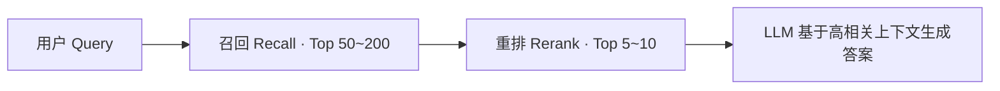

> 💡 重排（Rerank）是 RAG 检索链路的最后一道质量关口：先用便宜的方式把候选面铺宽，再用贵的方式精挑细选。本文面向开发者，讲清楚它"为什么存在、有哪些做法、怎么配参数、怎么评测、有哪些坑"。

# 一、为什么需要重排：两阶段检索架构

RAG 的检索环节普遍采用**召回（Recall）→ 重排（Rerank）**的两阶段架构。召回阶段用向量检索或 BM25 从海量文档中快速取回 Top 50~200 个候选，追求的是**召回率**——别把正确答案漏掉；但快是有代价的，召回结果里必然混入大量"语义相近但不真正回答问题"的噪音。重排阶段则用更强的模型对这批候选精算相关性，选出 Top 5~10 送入 LLM 上下文，追求的是**精确率**——喂给模型的每一段都要值得占上下文窗口。



这里有一个开发者最容易忽略的认知：**向量相似度 ≠ 回答问题的相关性**。主流 Embedding 模型是双塔（Bi-Encoder）结构，Query 和 Document 各自独立编码成向量再算距离，两段文本之间没有任何交互。这意味着只要语义分布接近（比如都谈论"退款流程"），向量分数就会高，哪怕文档根本不包含用户要的那个具体环节。而重排模型通常是 Cross-Encoder 结构，Query 和 Document 拼接后一起过模型，token 级别的深度交互使它能捕捉"这段文字到底有没有回答这个问题"。

| 维度 | 召回（Embedding / BM25） | 重排（Reranker） |
|-|-|-|
| 模型结构 | 双塔，Query 与 Doc 独立编码 | Cross-Encoder，两者拼接交互编码 |
| 候选规模 | 全库（百万级） | 几十到几百条候选 |
| 延迟 | 毫秒级（向量索引 / 倒排） | 随候选数线性增长 |
| 优化目标 | 召回率（别漏） | 精确率（别错） |

# 二、重排方法谱系

重排不是一个单一算法，而是一组按"精度上限 vs 计算成本"排列的方法。理解每种的适用条件，比记住某某个模型名更重要。

| 方法 | 原理 | 代表 | 适用场景 |
|-|-|-|-|
| **Cross-Encoder 重排** | Query+Doc 拼接过模型，输出相关性分数 | BGE-reranker-v2-m3、Qwen3-Reranker、Cohere Rerank、Jina Reranker | 主流默认选择；中文场景优先验证 BGE / Qwen 系 |
| **LLM Listwise 重排** | 把候选列表整体交给 LLM，直接输出排序或逐条打分 | RankGPT、让对话模型兼任 Reranker | 精度上限最高，但贵且慢；适合候选集小（≤20）的场景 |
| **多路分数融合** | 对 BM25、向量等信号按排名融合，无需训练模型 | RRF（Reciprocal Rank Fusion） | 混合检索（Hybrid Search）的标配后处理 |
| **规则重排** | 硬逻辑调整顺序：权限过滤、时效加权、去重 | MMR（最大边际相关性）、时间衰减 | 叠加在模型重排**之后**的最后一步 |

**RRF 值得单独强调**。BM25 分数、cosine 相似度、reranker 分数的量纲完全不同（一个是无界整数，一个是 0~1，一个依赖具体模型），绝对不可直接相加或加权求和。RRF 的思路是只看"排名"不看"分数"：每篇文档在每一路检索中的贡献是 1/(k + rank)，k 通常取 60，最后按文档累加。它公式简单、无参数可调、天然回避了分数归一化问题，是多路召回结果合并的事实标准。

```python
def rrf(rankings: list[list[str]], k: int = 60) -> dict[str, float]:
    scores: dict[str, float] = {}
    for ranking in rankings:          # 每一路检索结果的文档 id 排名
        for rank, doc_id in enumerate(ranking, start=1):
            scores[doc_id] = scores.get(doc_id, 0.0) + 1.0 / (k + rank)
    return dict(sorted(scores.items(), key=lambda x: -x[1]))
```

# 三、关键参数：漏斗、阈值与多样性

**召回量 → 重排量的漏斗设计**是重排工程的第一决策。Cross-Encoder 要对每个候选逐对打分，成本随候选数线性增长，无法像向量检索那样靠索引加速。典型配置是召回 50~100 条、重排后取 Top 5~10。候选太少（如 10 条），重排没有发挥空间，坏结果挤不出去；候选太多（如 500 条），延迟和成本爆炸，且排序质量的边际收益递减。漏斗比例没有普适最优值，必须用真实流量压测后确定。

**分数阈值是"宁缺毋滥"的开关。**重排分数（如 BGE 系的 sigmoid 输出）通常比向量余弦分数更有区分度，可以设一个绝对阈值：低于阈值宁可返回空结果，也不要把不相关的文档喂给 LLM。错误上下文会直接导致幻觉——LLM 倾向于"利用"任何被放进上下文的内容。空结果配上"知识库中未找到相关信息"的引导语，往往是更好的产品行为。

**MMR 解决"前 N 名都是同一观点"的问题。**纯按相关性排序时，Top 5 很可能是同一论点的五种重复表述（比如文档库里有五个版本都讲了"登录流程"）。MMR（Maximal Marginal Relevance）在选入每篇文档时同时权衡"与 query 的相关性"和"与已选文档的冗余度"，用参数 λ 控制两者比重，保证有限上下文内的信息覆盖度。

# 四、分块与上下文的交互

重排是**块级**操作，但用户问题的答案经常需要**跨块上下文**才能完整。一块 300 字的文本即使相关性满分，也可能缺少前后文的指代关系和背景铺垫。常见的补救手段有两种：一是**父块扩展**（Parent-Child Chunking）——用小块做召回和重排（小块语义聚焦、打分准），命中后改取其父级大块送入 LLM（上下文完整）；二是**邻块拼接**——把命中块前后各一个块拼在一起送入上下文。

这也反过来约束了分块策略本身：块太小，reranker 看不到足够语境，打分容易失准；块太大，无关内容稀释了信号，且重排通过后同样要占大量上下文。分块大小和重排粒度需要联合调优，而不是各自独立决策。

# 五、评测：最容易缺的一环

重排上线后"感觉变好了"不构成证据。评测要分三层做：

1. **离线指标**：构建标注集（真实 query + 人工标注的相关文档），对比重排前后的 NDCG@k、MRR、Recall@k。没有标注集就先用 LLM-as-judge 批量生成弱标注，但要知道它的偏差方向（LLM 更偏好措辞与 query 相似的文档）。
2. **端到端对照**：重排指标提升 ≠ 最终答案变好。必须做 A/B，观察答案的 faithfulness（忠实于检索内容）、引用命中率和人工评价。可能重排把"更相关"的文档排上来了，但那篇文档反而缺少可直接引用的表述。
3. **线上行为信号**：用户对引用的点击率、基于回答的追问率、反馈点踩率，是最终裁决。离线指标只负责在发布前拦截明显退化。

# 六、工程实践要点

**降级路径必须预设。**Reranker 服务是检索链路里最脆弱的一环——它是纯计算服务，没有索引兜底。超时或挂掉时应退回召回原始排序（向量分数或 RRF 分数），让链路降级运行而不是整体失败。同时要给重排调用设置严格的超时（通常几百毫秒量级）和失败熔断，避免长尾请求拖垮整体延迟。

**可观测性是归因的前提。**记录每次重排"前后顺序的变化"——哪些文档被顶上来、哪些被踢下去、分数各是多少。线上效果退化时，"是召回落了还是重排坏了"是第一个要回答的问题，没有这份数据就无法回答。这和任何生产系统记录前后快照的思路一致：无中间态，无归因。

**缓存可以显著摊薄成本。**FAQ 类场景下，相同 query 反复出现，query+doc pair 的重排分数可以按对缓存（注意 query 归一化后再做 key）。命中率高时，重排服务的均摊成本和延迟都会明显下降。

**中文场景不要照搬英文榜单。**BGE-reranker-v2-m3、Qwen3-Reranker 在中文语料上的表现需要用你们自己的 query 分布验证。公开榜单（MTEB、C-MTEB）的测试集和真实业务 query（口语化、多意图、含错别字、中英混排）是两个分布，榜单排名领先不代表业务效果好。

# 七、常见坑

- **分数混排**：把 reranker 分数和向量分数直接放进同一个排序比较。量纲不同，结果无意义；多路信号一律用 RRF 或显式归一化。
- **只测干净 query**：标注集全是措辞规整的 query，上线后被真实用户的口语化、错别字、多意图 query 打穿。评测集必须包含"脏" query。
- **忽略位置偏差**：LLM 做重排（listwise）时，对列表头部候选有系统性偏好。必要时随机打乱输入顺序跑多次再融合，或至少在评测时意识到这一点。
- **只优化相关性、丢掉时效性**：知识库场景下，旧文档往往措辞更"标准"、语义更贴近 query，重排后反而排在新文档前面。需要显式加时间衰减因子或时效性规则。
- **重排通过 ≠ 上下文可用**：高相关性分数不代表该块信息完整，记得配合父块扩展（见第四节）。

# 八、落地检查清单

- [ ] 召回量、重排候选量、最终取 Top K——漏斗三级参数已用真实流量压测确定
- [ ] 重排分数设有绝对阈值，低于阈值返回空结果并提示用户，而非硬塞给 LLM
- [ ] Reranker 超时 / 失败的降级路径已实现并演练过（退回召回排序）
- [ ] 重排前后顺序变化有日志，可回答"召回落了还是重排坏了"
- [ ] 离线标注集已建立（含脏 query），NDCG/MRR 有重排前后基线对比
- [ ] 端到端 A/B 已跑通，观察 faithfulness 与用户行为信号而非仅检索指标
- [ ] 多路检索信号用 RRF 融合，未做分数直接相加
